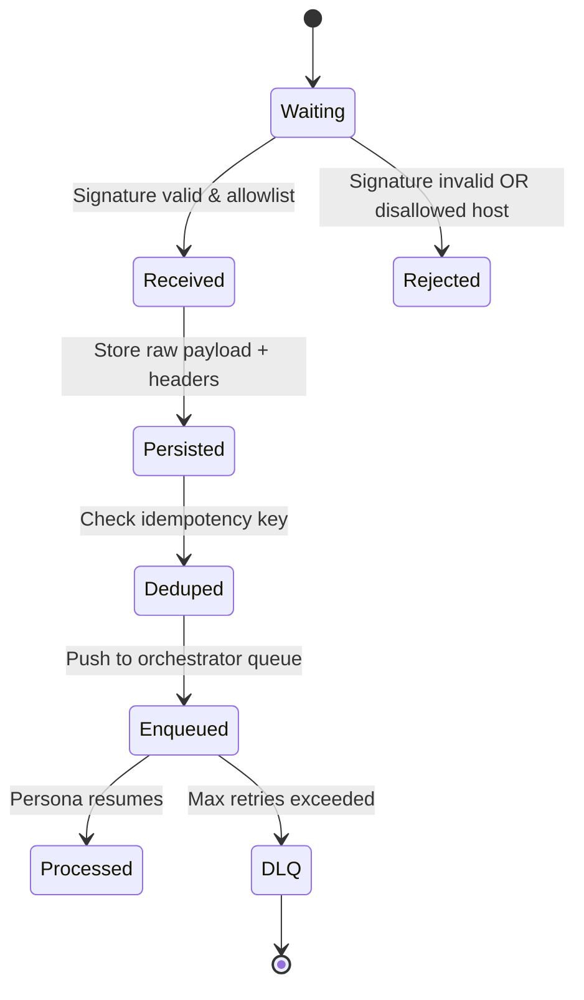
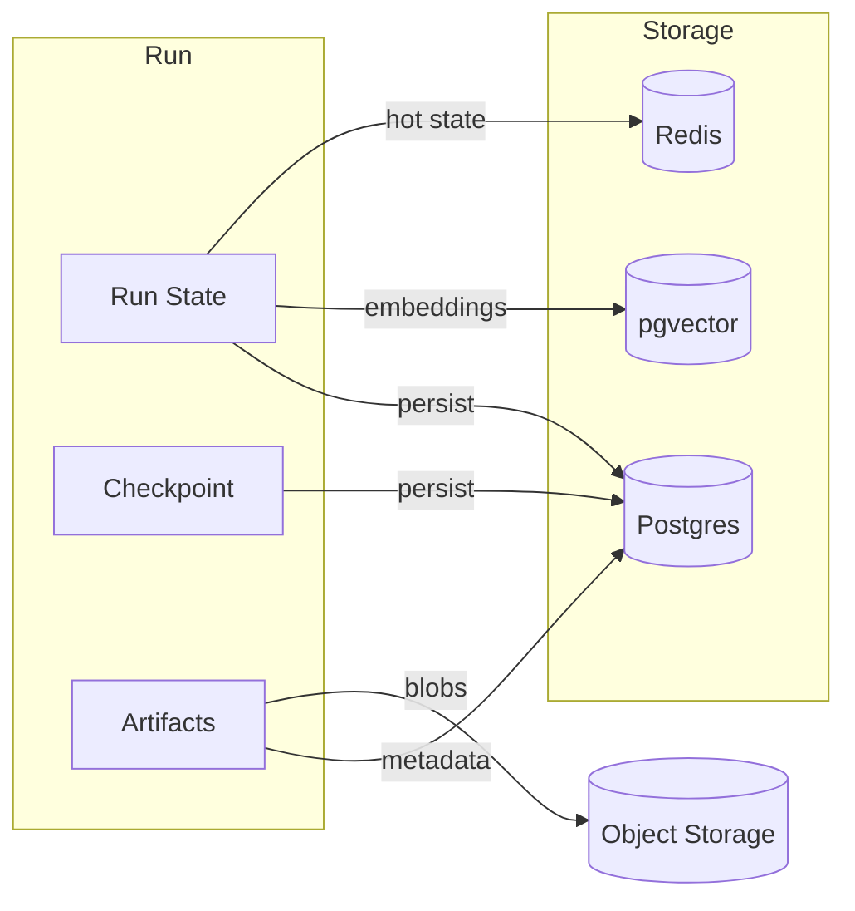
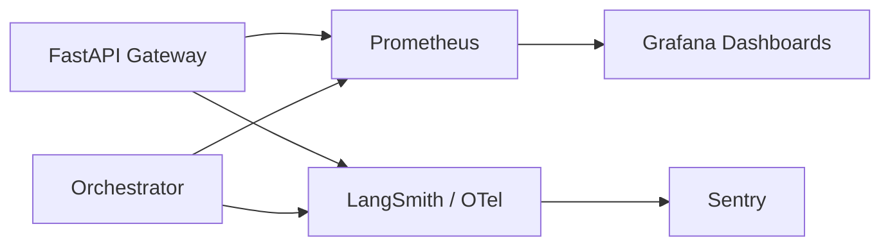
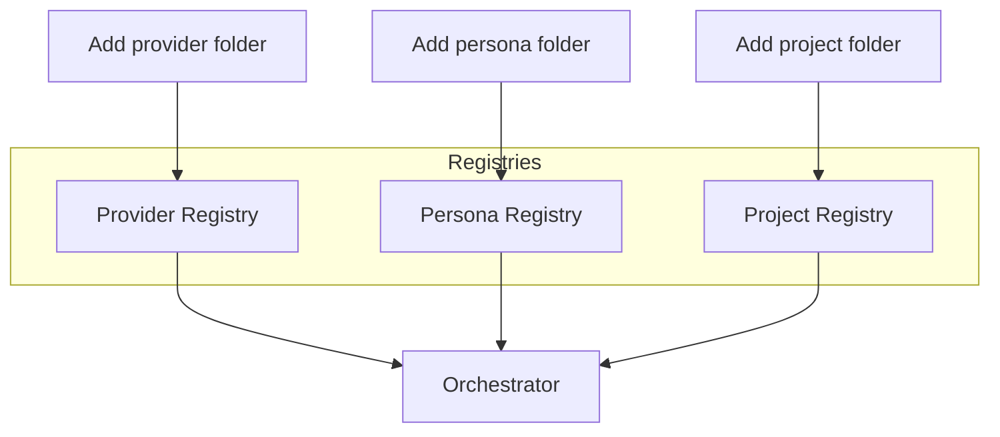

# Architecture Diagrams

Visual reference for how MyloWare's services, personas, and reliability controls fit together.

## System Overview

```mermaid
graph LR
  subgraph Entry[Entry Points]
    TGM[Telegram]
    HTTP[HTTP API]
    MCP[MCP Client]
  end

  subgraph Gateway[FastAPI Gateway]
    BR[Brendan Chat /v1/chat/brendan]
    HITL[HITL Approvals /v1/hitl]
    WH[Webhook Receivers]
  end

  subgraph Orchestrator[LangGraph Orchestrator]
    SUP[Supervisor Node]
    IGG[Iggy (Ideate)]
    RIL[Riley (Produce)]
    ALX[Alex (Edit)]
    QNN[Quinn (Publish)]
  end

  subgraph Data[Data Stores]
    PG[(Postgres + pgvector)]
    REDIS[(Redis)]
    S3[(Artifact Storage)]
  end

  Entry --> BR
  Entry --> HITL
  Entry --> WH
  BR --> Orchestrator
  HITL --> Orchestrator
  Orchestrator --> PG
  Orchestrator --> REDIS
  Orchestrator --> S3
  WH --> Orchestrator
  Orchestrator -->|Traces| LS[LangSmith]
```

## Persona Pipeline (AISMR)

```mermaid
graph TD
  A[Brendan: classify + plan] --> B[Iggy: ideate prompts]
  B -->|HITL ideate| C[Riley: generate clips (kie.ai)]
  C --> D[Alex: assemble + render (Shotstack + FFmpeg)]
  D -->|HITL prepublish| E[Quinn: publish (upload-post/TikTok)]
  E --> F[Artifacts saved + canonical URL]
```

## Webhook Reliability Path



## Data Flow per Run



## Observability Signals



## Extension Points


