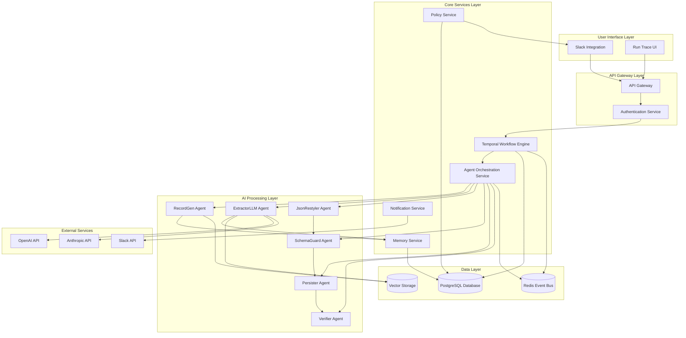
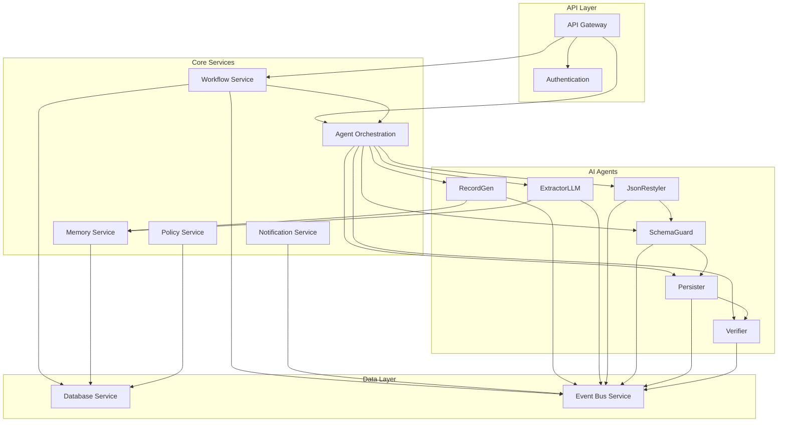
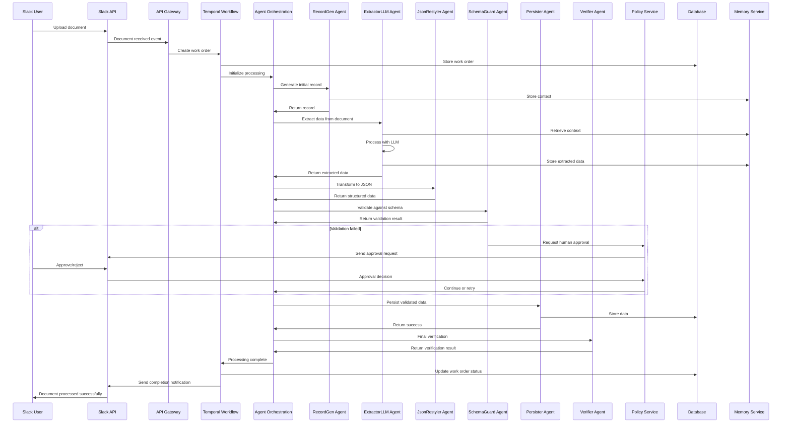
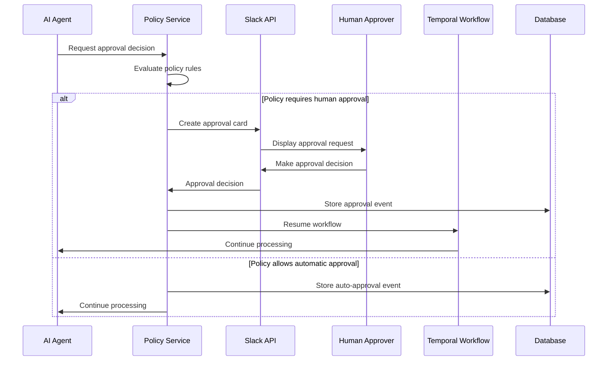
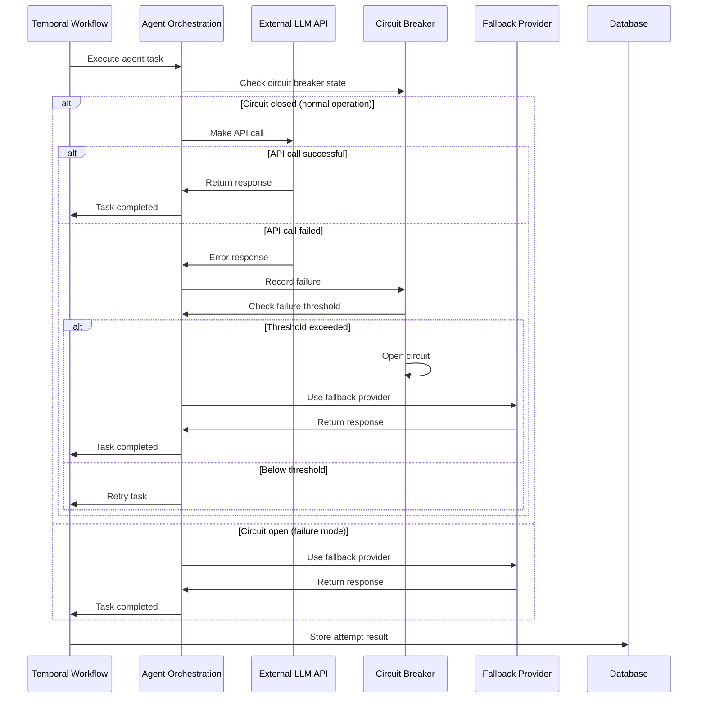

# MyloWare Architecture Document

## Introduction

This document outlines the overall project architecture for MyloWare, including backend systems, shared services, and non-UI specific concerns. Its primary goal is to serve as the guiding architectural blueprint for AI-driven development, ensuring consistency and adherence to chosen patterns and technologies.

**Relationship to Frontend Architecture:**
The MyloWare platform is primarily Slack-first with a web-based Run Trace UI for observability. This architecture document covers the core backend systems, while the Run Trace UI frontend architecture will be detailed in a separate Frontend Architecture Document that MUST be used in conjunction with this document. Core technology stack choices documented herein (see "Tech Stack") are definitive for the entire project, including any frontend components.

### Starter Template or Existing Project

**Decision: N/A - Greenfield Project**

MyloWare is a greenfield project with no existing codebase or starter template dependencies. The architecture will be built from scratch using modern, proven technologies aligned with the PRD requirements.

### Change Log

| Date | Version | Description | Author |
|------|---------|-------------|---------|
| 2024-12-19 | v1.0 | Initial architecture document based on validated PRD | Winton (PO) |

## High Level Architecture

### Technical Summary

MyloWare implements a **simplified microservices architecture** with **event-driven communication** and **Temporal workflow orchestration**. The system uses **PostgreSQL** for data persistence, **Redis Streams** for event bus communication, and **OpenAI Agents SDK** for AI orchestration. The architecture follows **Slack-first integration** with **human-in-the-loop governance** and emphasizes **cost optimization** and **operational excellence**. This design supports the PRD's goals of rapid MVP delivery, enterprise governance, and scalable AI-powered document processing.

### High Level Overview

**Architectural Style:** Simplified Microservices with Event-Driven Communication

**Repository Structure:** Monorepo (as specified in PRD) for unified development and deployment

**Service Architecture:** 
- Core microservices with clear boundaries
- Temporal for workflow orchestration and state management
- Event-driven communication via Redis Streams
- HTTP REST APIs for service communication (MVP phase)

**Primary User Interaction Flow:**
1. Users interact primarily through Slack integration
2. Document processing workflows are orchestrated by Temporal
3. AI agents process documents using OpenAI Agents SDK
4. Human-in-the-loop approvals occur via Slack approval cards
5. Run Trace UI provides observability and debugging capabilities

**Key Architectural Decisions:**
- **Simplified Microservices**: Reduced complexity for MVP while maintaining scalability
- **Temporal Workflow Orchestration**: Ensures deterministic execution, retries, and idempotency
- **Event-Driven Communication**: Decouples services and enables async processing
- **Slack-First Integration**: Primary user interface for rapid adoption
- **Cost-Optimized AI**: Multi-provider strategy with strict token budgeting

### High Level Project Diagram


```mermaid
graph TB
    subgraph "User Interface Layer"
        SLACK[Slack Integration]
        WEB[Run Trace UI]
    end
    
    subgraph "API Gateway Layer"
        API[API Gateway]
        AUTH[Authentication Service]
    end
    
    subgraph "Core Services Layer"
        WORKFLOW[Temporal Workflow Engine]
        AGENT[Agent Orchestration Service]
        MEMORY[Memory Service]
        POLICY[Policy Service]
        NOTIFY[Notification Service]
    end
    
    subgraph "AI Processing Layer"
        RECORD[RecordGen Agent]
        EXTRACT[ExtractorLLM Agent]
        JSON[JsonRestyler Agent]
        SCHEMA[SchemaGuard Agent]
        PERSIST[Persister Agent]
        VERIFY[Verifier Agent]
    end
    
    subgraph "Data Layer"
        DB[(PostgreSQL Database)]
        REDIS[(Redis Event Bus)]
        VECTOR[(Vector Storage)]
    end
    
    subgraph "External Services"
        OPENAI[OpenAI API]
        ANTHROPIC[Anthropic API]
        SLACK_API[Slack API]
    end
    
    SLACK --> API
    WEB --> API
    API --> AUTH
    AUTH --> WORKFLOW
    WORKFLOW --> AGENT
    AGENT --> RECORD
    AGENT --> EXTRACT
    AGENT --> JSON
    AGENT --> SCHEMA
    AGENT --> PERSIST
    AGENT --> VERIFY
    
    RECORD --> MEMORY
    EXTRACT --> MEMORY
    JSON --> SCHEMA
    SCHEMA --> PERSIST
    PERSIST --> VERIFY
    
    WORKFLOW --> DB
    MEMORY --> DB
    POLICY --> DB
    
    AGENT --> REDIS
    WORKFLOW --> REDIS
    
    RECORD --> VECTOR
    EXTRACT --> VECTOR
    
    EXTRACT --> OPENAI
    EXTRACT --> ANTHROPIC
    
    NOTIFY --> SLACK_API
    POLICY --> SLACK
```

### Architectural and Design Patterns

**Event-Driven Architecture:** Using Redis Streams for asynchronous service communication - *Rationale:* Enables loose coupling, supports high throughput, and provides reliable message delivery with consumer groups

**Workflow Orchestration Pattern:** Using Temporal for complex workflow management - *Rationale:* Provides deterministic execution, built-in retries, idempotency, and comprehensive observability for document processing workflows

**Repository Pattern:** Abstract data access logic across all services - *Rationale:* Enables testing, supports future database migrations, and provides consistent data access patterns

**Agent Pattern:** Using OpenAI Agents SDK for AI orchestration - *Rationale:* Provides standardized agent interfaces, built-in memory management, and tool integration capabilities

**CQRS Pattern:** Separate read and write models for complex queries - *Rationale:* Optimizes performance for different access patterns and supports complex reporting requirements

**Circuit Breaker Pattern:** For external API calls (OpenAI, Anthropic) - *Rationale:* Prevents cascading failures and provides graceful degradation when external services are unavailable

**Outbox Pattern:** For reliable event publishing - *Rationale:* Ensures events are published even if the event bus is temporarily unavailable

## Tech Stack

**CRITICAL: This section defines the definitive technology choices for the entire MyloWare platform. All other documents must reference these choices.**

### Cloud Infrastructure
- **Provider:** AWS (Amazon Web Services)
- **Key Services:** ECS Fargate, RDS PostgreSQL, ElastiCache Redis, CloudWatch, IAM, Secrets Manager
- **Deployment Regions:** us-east-1 (primary), us-west-2 (backup)

### Technology Stack Table

| Category | Technology | Version | Purpose | Rationale |
|----------|------------|---------|---------|-----------|
| **Language** | TypeScript | 5.3.3 | Primary development language | Strong typing, excellent tooling, team expertise, type safety for complex workflows |
| **Runtime** | Node.js | 20.11.0 | JavaScript runtime | LTS version, stable performance, wide ecosystem, excellent async support |
| **Framework** | NestJS | 10.3.2 | Backend framework | Enterprise-ready, dependency injection, decorators, excellent TypeScript support |
| **Workflow Engine** | Temporal | 1.22.0 | Workflow orchestration | Deterministic execution, retries, idempotency, comprehensive observability |
| **Database** | PostgreSQL | 15.5 | Primary data store | ACID compliance, JSON support, excellent performance, mature ecosystem |
| **Event Bus** | Redis | 7.2.0 | Message queue and caching | High performance, streams support, pub/sub, in-memory caching |
| **AI Framework** | OpenAI Agents SDK | 0.1.0 | Agent orchestration | Standardized agent interfaces, built-in memory, tool integration |
| **API Documentation** | OpenAPI | 3.0.3 | API specification | Industry standard, excellent tooling, code generation support |
| **Testing** | Jest | 29.7.0 | Unit and integration testing | Excellent TypeScript support, mocking capabilities, coverage reporting |
| **Containerization** | Docker | 24.0.0 | Application packaging | Consistent environments, easy deployment, cloud-native ready |
| **Orchestration** | Docker Compose | 2.20.0 | Local development | Simple local setup, service coordination, development workflow |
| **CI/CD** | GitHub Actions | Latest | Continuous integration | Native GitHub integration, extensive marketplace, cost-effective |
| **Monitoring** | CloudWatch | Latest | Application monitoring | Native AWS integration, comprehensive metrics, alerting |
| **Logging** | Winston | 3.11.0 | Application logging | Structured logging, multiple transports, excellent performance |
| **Validation** | Joi | 17.11.0 | Input validation | Schema-based validation, excellent error messages, TypeScript support |
| **Authentication** | JWT | 9.0.2 | Token-based auth | Stateless, scalable, industry standard |
| **HTTP Client** | Axios | 1.6.0 | HTTP requests | Promise-based, interceptors, excellent error handling |
| **Database ORM** | Prisma | 5.7.0 | Database access | Type-safe queries, migrations, excellent TypeScript integration |
| **Vector Storage** | pgvector | 0.5.0 | Vector embeddings | PostgreSQL extension, excellent performance, ACID compliance |
| **Slack SDK** | @slack/bolt | 3.17.0 | Slack integration | Official SDK, comprehensive features, excellent documentation |

**Please review these technology choices carefully. Are there any gaps, disagreements, or clarifications needed? These choices will guide all subsequent development.**

## Data Models

### Core Business Entities

**WorkOrder**
- **Purpose:** Represents a document processing request with associated metadata and workflow state
- **Key Attributes:**
  - `id`: UUID - Unique identifier for the work order
  - `status`: WorkOrderStatus - Current processing status (PENDING, PROCESSING, COMPLETED, FAILED)
  - `priority`: Priority - Processing priority (LOW, MEDIUM, HIGH, URGENT)
  - `created_at`: DateTime - Timestamp when work order was created
  - `updated_at`: DateTime - Last modification timestamp
  - `metadata`: JSON - Flexible metadata storage for document-specific information
  - `workflow_id`: String - Temporal workflow identifier
  - `tenant_id`: UUID - Multi-tenant isolation
- **Relationships:**
  - Has many WorkItems (one-to-many)
  - Has many Attempts (one-to-many)
  - Belongs to Tenant (many-to-one)

**WorkItem**
- **Purpose:** Individual document or task within a work order that gets processed by agents
- **Key Attributes:**
  - `id`: UUID - Unique identifier for the work item
  - `work_order_id`: UUID - Reference to parent work order
  - `type`: WorkItemType - Type of processing (INVOICE, TICKET, STATUS_REPORT)
  - `content`: Text - Raw document content or file reference
  - `status`: WorkItemStatus - Processing status (QUEUED, PROCESSING, COMPLETED, FAILED)
  - `result`: JSON - Extracted and processed data
  - `created_at`: DateTime - Creation timestamp
  - `processed_at`: DateTime - Processing completion timestamp
- **Relationships:**
  - Belongs to WorkOrder (many-to-one)
  - Has many Attempts (one-to-many)
  - Has many MemDocs (one-to-many)

**Attempt**
- **Purpose:** Tracks individual processing attempts for work items with detailed execution history
- **Key Attributes:**
  - `id`: UUID - Unique attempt identifier
  - `work_item_id`: UUID - Reference to work item being processed
  - `agent_id`: String - Identifier of the agent that processed this attempt
  - `status`: AttemptStatus - Execution status (STARTED, COMPLETED, FAILED, TIMEOUT)
  - `input`: JSON - Input data provided to the agent
  - `output`: JSON - Output data from the agent
  - `error`: Text - Error message if attempt failed
  - `started_at`: DateTime - When processing began
  - `completed_at`: DateTime - When processing completed
  - `duration_ms`: Integer - Processing duration in milliseconds
- **Relationships:**
  - Belongs to WorkItem (many-to-one)
  - Belongs to Agent (many-to-one)

**MemDoc**
- **Purpose:** Memory documents that store context and knowledge for agent processing
- **Key Attributes:**
  - `id`: UUID - Unique memory document identifier
  - `work_item_id`: UUID - Associated work item
  - `type`: MemDocType - Type of memory (CONTEXT, KNOWLEDGE, TEMPLATE)
  - `content`: Text - Memory content
  - `embedding`: Vector - Vector representation for similarity search
  - `metadata`: JSON - Additional metadata
  - `created_at`: DateTime - Creation timestamp
  - `last_accessed`: DateTime - Last access timestamp
- **Relationships:**
  - Belongs to WorkItem (many-to-one)
  - Has many related MemDocs (many-to-many through similarity)

**ApprovalEvent**
- **Purpose:** Tracks human-in-the-loop approval decisions and governance actions
- **Key Attributes:**
  - `id`: UUID - Unique approval event identifier
  - `work_item_id`: UUID - Associated work item requiring approval
  - `approver_id`: String - User identifier who made the decision
  - `decision`: ApprovalDecision - Decision made (APPROVED, REJECTED, ESCALATED)
  - `reason`: Text - Reason for decision
  - `timestamp`: DateTime - When decision was made
  - `policy_version`: String - Version of policy that was applied
- **Relationships:**
  - Belongs to WorkItem (many-to-one)
  - Belongs to User (many-to-one)

**DeadLetter**
- **Purpose:** Stores failed events and messages for investigation and reprocessing
- **Key Attributes:**
  - `id`: UUID - Unique dead letter identifier
  - `source`: String - Source system that generated the failed event
  - `event_type`: String - Type of event that failed
  - `payload`: JSON - Original event payload
  - `error`: Text - Error that caused the failure
  - `retry_count`: Integer - Number of retry attempts
  - `created_at`: DateTime - When the dead letter was created
  - `processed_at`: DateTime - When it was successfully reprocessed
- **Relationships:**
  - Standalone entity for error tracking and recovery

### Platform Entities

**Connector**
- **Purpose:** Configuration for external system integrations and data sources
- **Key Attributes:**
  - `id`: UUID - Unique connector identifier
  - `name`: String - Human-readable connector name
  - `type`: ConnectorType - Type of connector (SLACK, EMAIL, API, DATABASE)
  - `config`: JSON - Connection configuration and credentials
  - `status`: ConnectorStatus - Connection status (ACTIVE, INACTIVE, ERROR)
  - `created_at`: DateTime - Creation timestamp
  - `last_health_check`: DateTime - Last health check timestamp
- **Relationships:**
  - Has many Tools (one-to-many)
  - Belongs to Tenant (many-to-one)

**Tool**
- **Purpose:** Defines available tools and capabilities that agents can use
- **Key Attributes:**
  - `id`: UUID - Unique tool identifier
  - `name`: String - Tool name
  - `description`: Text - Tool description
  - `connector_id`: UUID - Associated connector
  - `schema`: JSON - Tool input/output schema
  - `is_active`: Boolean - Whether tool is available for use
  - `created_at`: DateTime - Creation timestamp
- **Relationships:**
  - Belongs to Connector (many-to-one)
  - Has many Capabilities (many-to-many)

**Capability**
- **Purpose:** Defines permissions and access controls for users and services
- **Key Attributes:**
  - `id`: UUID - Unique capability identifier
  - `name`: String - Capability name
  - `description`: Text - Capability description
  - `scope`: String - Scope of the capability
  - `permissions`: JSON - Specific permissions granted
  - `created_at`: DateTime - Creation timestamp
- **Relationships:**
  - Has many Tools (many-to-many)
  - Has many Users (many-to-many)

**Schema**
- **Purpose:** Defines data schemas for document types and validation rules
- **Key Attributes:**
  - `id`: UUID - Unique schema identifier
  - `name`: String - Schema name
  - `version`: String - Schema version
  - `document_type`: String - Type of document this schema applies to
  - `schema_definition`: JSON - JSON Schema definition
  - `is_active`: Boolean - Whether schema is active
  - `created_at`: DateTime - Creation timestamp
- **Relationships:**
  - Has many WorkItems (one-to-many through document_type)

**WorkflowTemplate**
- **Purpose:** Defines reusable workflow templates for different document processing scenarios
- **Key Attributes:**
  - `id`: UUID - Unique template identifier
  - `name`: String - Template name
  - `description`: Text - Template description
  - `document_type`: String - Document type this template applies to
  - `workflow_definition`: JSON - Temporal workflow definition
  - `is_active`: Boolean - Whether template is active
  - `created_at`: DateTime - Creation timestamp
- **Relationships:**
  - Has many WorkOrders (one-to-many through document_type)

**EvalResult**
- **Purpose:** Stores evaluation results for quality assurance and performance monitoring
- **Key Attributes:**
  - `id`: UUID - Unique evaluation result identifier
  - `work_item_id`: UUID - Associated work item
  - `evaluation_type`: String - Type of evaluation performed
  - `score`: Float - Evaluation score (0.0 to 1.0)
  - `metrics`: JSON - Detailed evaluation metrics
  - `passed`: Boolean - Whether evaluation passed threshold
  - `created_at`: DateTime - When evaluation was performed
- **Relationships:**
  - Belongs to WorkItem (many-to-one)

## Components

### Core Service Components

**API Gateway Service**
- **Responsibility:** Central entry point for all external requests, authentication, rate limiting, and request routing
- **Key Interfaces:**
  - REST API endpoints for work order management
  - WebSocket connections for real-time updates
  - Authentication and authorization middleware
  - Request/response transformation and validation
- **Dependencies:** Authentication Service, Workflow Service, Notification Service
- **Technology Stack:** NestJS, JWT authentication, rate limiting middleware, OpenAPI documentation

**Workflow Orchestration Service**
- **Responsibility:** Manages Temporal workflows, coordinates document processing, and maintains workflow state
- **Key Interfaces:**
  - Workflow creation and management APIs
  - Workflow status and progress tracking
  - Error handling and retry logic
  - Workflow template management
- **Dependencies:** Temporal, Agent Orchestration Service, Database Service
- **Technology Stack:** Temporal SDK, NestJS, Prisma ORM, Winston logging

**Agent Orchestration Service**
- **Responsibility:** Manages AI agents, coordinates agent interactions, and handles agent lifecycle
- **Key Interfaces:**
  - Agent creation and configuration APIs
  - Agent execution and monitoring
  - Tool integration and management
  - Agent memory and context management
- **Dependencies:** OpenAI Agents SDK, Memory Service, Tool Service, External AI APIs
- **Technology Stack:** OpenAI Agents SDK, NestJS, Axios for API calls, Circuit breaker pattern

**Memory Service**
- **Responsibility:** Manages agent memory, context storage, and knowledge retrieval
- **Key Interfaces:**
  - Memory document CRUD operations
  - Vector similarity search
  - Context retrieval and management
  - Memory optimization and cleanup
- **Dependencies:** PostgreSQL with pgvector, Redis for caching
- **Technology Stack:** Prisma ORM, pgvector extension, Redis caching, Vector similarity algorithms

**Policy Service**
- **Responsibility:** Implements human-in-the-loop policies, approval workflows, and governance rules
- **Key Interfaces:**
  - Policy evaluation and decision APIs
  - Approval workflow management
  - Policy versioning and updates
  - Audit trail and compliance tracking
- **Dependencies:** Database Service, Notification Service, Slack Integration
- **Technology Stack:** NestJS, Joi validation, Policy engine, Audit logging

**Notification Service**
- **Responsibility:** Handles all notifications, alerts, and communication with external systems
- **Key Interfaces:**
  - Slack integration and message sending
  - Email notifications and alerts
  - Webhook management and delivery
  - Notification templating and personalization
- **Dependencies:** Slack API, Email service, Webhook management
- **Technology Stack:** @slack/bolt SDK, Nodemailer, Webhook management, Template engine

**Database Service**
- **Responsibility:** Centralized data access layer with repository pattern implementation
- **Key Interfaces:**
  - Repository interfaces for all entities
  - Transaction management
  - Data validation and sanitization
  - Database migration and schema management
- **Dependencies:** PostgreSQL, Redis
- **Technology Stack:** Prisma ORM, Database migrations, Connection pooling, Data validation

**Event Bus Service**
- **Responsibility:** Manages Redis Streams for event-driven communication between services
- **Key Interfaces:**
  - Event publishing and subscription
  - Consumer group management
  - Dead letter queue handling
  - Event schema validation
- **Dependencies:** Redis Streams
- **Technology Stack:** Redis client, Stream processing, Consumer groups, Outbox pattern

### AI Agent Components

**RecordGen Agent**
- **Responsibility:** Generates initial records and context for document processing
- **Key Interfaces:**
  - Document analysis and record generation
  - Context extraction and summarization
  - Initial data structure creation
- **Dependencies:** OpenAI/Anthropic APIs, Memory Service
- **Technology Stack:** OpenAI Agents SDK, Prompt engineering, Context management

**ExtractorLLM Agent**
- **Responsibility:** Extracts structured data from documents using LLM processing
- **Key Interfaces:**
  - Document content extraction
  - Structured data generation
  - Multi-format document support
- **Dependencies:** OpenAI/Anthropic APIs, Schema Service
- **Technology Stack:** OpenAI Agents SDK, Multi-provider strategy, Token budgeting

**JsonRestyler Agent**
- **Responsibility:** Transforms and standardizes extracted data into consistent JSON format
- **Key Interfaces:**
  - Data transformation and normalization
  - JSON schema compliance
  - Data quality validation
- **Dependencies:** Schema Service, Validation Service
- **Technology Stack:** JSON processing, Schema validation, Data transformation

**SchemaGuard Agent**
- **Responsibility:** Validates data against schemas and ensures compliance with business rules
- **Key Interfaces:**
  - Schema validation and enforcement
  - Business rule checking
  - Data quality assessment
- **Dependencies:** Schema Service, Policy Service
- **Technology Stack:** JSON Schema validation, Business rule engine, Quality metrics

**Persister Agent**
- **Responsibility:** Persists validated data to the database and manages data lifecycle
- **Key Interfaces:**
  - Data persistence operations
  - Transaction management
  - Data versioning and history
- **Dependencies:** Database Service, Transaction Service
- **Technology Stack:** Prisma ORM, Transaction management, Data versioning

**Verifier Agent**
- **Responsibility:** Performs final verification and quality assurance on processed data
- **Key Interfaces:**
  - Data verification and validation
  - Quality scoring and assessment
  - Error detection and reporting
- **Dependencies:** Quality Service, Notification Service
- **Technology Stack:** Quality assessment algorithms, Verification rules, Error reporting

### Component Diagrams


```mermaid
graph TB
    subgraph "API Layer"
        API[API Gateway]
        AUTH[Authentication]
    end
    
    subgraph "Core Services"
        WORKFLOW[Workflow Service]
        AGENT[Agent Orchestration]
        MEMORY[Memory Service]
        POLICY[Policy Service]
        NOTIFY[Notification Service]
    end
    
    subgraph "Data Layer"
        DB[Database Service]
        EVENT[Event Bus Service]
    end
    
    subgraph "AI Agents"
        RECORD[RecordGen]
        EXTRACT[ExtractorLLM]
        JSON[JsonRestyler]
        SCHEMA[SchemaGuard]
        PERSIST[Persister]
        VERIFY[Verifier]
    end
    
    API --> AUTH
    API --> WORKFLOW
    API --> AGENT
    
    WORKFLOW --> AGENT
    WORKFLOW --> DB
    WORKFLOW --> EVENT
    
    AGENT --> RECORD
    AGENT --> EXTRACT
    AGENT --> JSON
    AGENT --> SCHEMA
    AGENT --> PERSIST
    AGENT --> VERIFY
    
    RECORD --> MEMORY
    EXTRACT --> MEMORY
    JSON --> SCHEMA
    SCHEMA --> PERSIST
    PERSIST --> VERIFY
    
    MEMORY --> DB
    POLICY --> DB
    NOTIFY --> EVENT
    
    RECORD --> EVENT
    EXTRACT --> EVENT
    JSON --> EVENT
    SCHEMA --> EVENT
    PERSIST --> EVENT
    VERIFY --> EVENT
```

## External APIs

### OpenAI API
- **Purpose:** Primary LLM provider for document processing and AI agent operations
- **Documentation:** https://platform.openai.com/docs
- **Base URL(s):** https://api.openai.com/v1
- **Authentication:** Bearer token (API key)
- **Rate Limits:** Varies by model and plan (typically 3,000-10,000 requests/minute)

**Key Endpoints Used:**
- `POST /chat/completions` - Generate text completions for document processing
- `POST /embeddings` - Generate embeddings for vector storage
- `POST /models` - List available models and capabilities

**Integration Notes:** Implement circuit breaker pattern, token budgeting, and fallback to alternative providers

### Anthropic API
- **Purpose:** Secondary LLM provider for redundancy and cost optimization
- **Documentation:** https://docs.anthropic.com/
- **Base URL(s):** https://api.anthropic.com
- **Authentication:** Bearer token (API key)
- **Rate Limits:** Varies by plan (typically 1,000-5,000 requests/minute)

**Key Endpoints Used:**
- `POST /v1/messages` - Generate text completions using Claude models
- `POST /v1/embeddings` - Generate embeddings for vector storage

**Integration Notes:** Used as fallback when OpenAI is unavailable or for specific use cases requiring Claude's capabilities

### Slack API
- **Purpose:** Primary user interface and notification system
- **Documentation:** https://api.slack.com/
- **Base URL(s):** https://slack.com/api
- **Authentication:** Bot token with OAuth scopes
- **Rate Limits:** 50 requests per second per workspace

**Key Endpoints Used:**
- `POST /chat.postMessage` - Send messages to channels or users
- `POST /views.open` - Open modal dialogs for user interaction
- `POST /chat.postEphemeral` - Send temporary messages
- `GET /users.list` - Retrieve user information
- `POST /reactions.add` - Add reactions to messages

**Integration Notes:** Implement Socket Mode for real-time events, handle rate limiting, and manage bot token lifecycle

## Core Workflows

### Document Processing Workflow


```mermaid
sequenceDiagram
    participant User as Slack User
    participant Slack as Slack API
    participant API as API Gateway
    participant Workflow as Temporal Workflow
    participant Agent as Agent Orchestration
    participant Record as RecordGen Agent
    participant Extract as ExtractorLLM Agent
    participant Json as JsonRestyler Agent
    participant Schema as SchemaGuard Agent
    participant Persist as Persister Agent
    participant Verify as Verifier Agent
    participant Policy as Policy Service
    participant DB as Database
    participant Memory as Memory Service

    User->>Slack: Upload document
    Slack->>API: Document received event
    API->>Workflow: Create work order
    Workflow->>DB: Store work order
    Workflow->>Agent: Initialize processing
    
    Agent->>Record: Generate initial record
    Record->>Memory: Store context
    Record->>Agent: Return record
    
    Agent->>Extract: Extract data from document
    Extract->>Memory: Retrieve context
    Extract->>Extract: Process with LLM
    Extract->>Memory: Store extracted data
    Extract->>Agent: Return extracted data
    
    Agent->>Json: Transform to JSON
    Json->>Agent: Return structured data
    
    Agent->>Schema: Validate against schema
    Schema->>Agent: Return validation result
    
    alt Validation failed
        Schema->>Policy: Request human approval
        Policy->>Slack: Send approval request
        User->>Slack: Approve/reject
        Slack->>Policy: Approval decision
        Policy->>Agent: Continue or retry
    end
    
    Agent->>Persist: Persist validated data
    Persist->>DB: Store data
    Persist->>Agent: Return success
    
    Agent->>Verify: Final verification
    Verify->>Agent: Return verification result
    
    Agent->>Workflow: Processing complete
    Workflow->>DB: Update work order status
    Workflow->>Slack: Send completion notification
    Slack->>User: Document processed successfully
```

### Human-in-the-Loop Approval Workflow


```mermaid
sequenceDiagram
    participant Agent as AI Agent
    participant Policy as Policy Service
    participant Slack as Slack API
    participant User as Human Approver
    participant Workflow as Temporal Workflow
    participant DB as Database

    Agent->>Policy: Request approval decision
    Policy->>Policy: Evaluate policy rules
    
    alt Policy requires human approval
        Policy->>Slack: Create approval card
        Slack->>User: Display approval request
        User->>Slack: Make approval decision
        Slack->>Policy: Approval decision
        Policy->>DB: Store approval event
        Policy->>Workflow: Resume workflow
        Workflow->>Agent: Continue processing
    else Policy allows automatic approval
        Policy->>DB: Store auto-approval event
        Policy->>Agent: Continue processing
    end
```

### Error Handling and Retry Workflow


```mermaid
sequenceDiagram
    participant Workflow as Temporal Workflow
    participant Agent as Agent Orchestration
    participant LLM as External LLM API
    participant Circuit as Circuit Breaker
    participant Fallback as Fallback Provider
    participant DB as Database

    Workflow->>Agent: Execute agent task
    Agent->>Circuit: Check circuit breaker state
    
    alt Circuit closed (normal operation)
        Agent->>LLM: Make API call
        alt API call successful
            LLM->>Agent: Return response
            Agent->>Workflow: Task completed
        else API call failed
            LLM->>Agent: Error response
            Agent->>Circuit: Record failure
            Circuit->>Agent: Check failure threshold
            alt Threshold exceeded
                Circuit->>Circuit: Open circuit
                Agent->>Fallback: Use fallback provider
                Fallback->>Agent: Return response
                Agent->>Workflow: Task completed
            else Below threshold
                Agent->>Workflow: Retry task
            end
        end
    else Circuit open (failure mode)
        Agent->>Fallback: Use fallback provider
        Fallback->>Agent: Return response
        Agent->>Workflow: Task completed
    end
    
    Workflow->>DB: Store attempt result
```

## REST API Spec

```yaml
openapi: 3.0.3
info:
  title: MyloWare Platform API
  version: 1.0.0
  description: API for AI-powered document processing with human-in-the-loop governance
servers:
  - url: https://api.myloware.com/v1
    description: Production API server
  - url: https://staging-api.myloware.com/v1
    description: Staging API server

components:
  securitySchemes:
    BearerAuth:
      type: http
      scheme: bearer
      bearerFormat: JWT
    ApiKeyAuth:
      type: apiKey
      in: header
      name: X-API-Key

  schemas:
    WorkOrder:
      type: object
      properties:
        id:
          type: string
          format: uuid
          description: Unique work order identifier
        status:
          type: string
          enum: [PENDING, PROCESSING, COMPLETED, FAILED]
          description: Current processing status
        priority:
          type: string
          enum: [LOW, MEDIUM, HIGH, URGENT]
          description: Processing priority
        metadata:
          type: object
          description: Flexible metadata storage
        created_at:
          type: string
          format: date-time
        updated_at:
          type: string
          format: date-time
        workflow_id:
          type: string
          description: Temporal workflow identifier
        tenant_id:
          type: string
          format: uuid
      required: [id, status, priority, created_at, tenant_id]

    WorkItem:
      type: object
      properties:
        id:
          type: string
          format: uuid
        work_order_id:
          type: string
          format: uuid
        type:
          type: string
          enum: [INVOICE, TICKET, STATUS_REPORT]
        content:
          type: string
          description: Raw document content or file reference
        status:
          type: string
          enum: [QUEUED, PROCESSING, COMPLETED, FAILED]
        result:
          type: object
          description: Extracted and processed data
        created_at:
          type: string
          format: date-time
        processed_at:
          type: string
          format: date-time
      required: [id, work_order_id, type, content, status, created_at]

    ApiResponse:
      type: object
      properties:
        success:
          type: boolean
        data:
          type: object
        message:
          type: string
        timestamp:
          type: string
          format: date-time

paths:
  /work-orders:
    get:
      summary: List work orders
      security:
        - BearerAuth: []
      parameters:
        - name: status
          in: query
          schema:
            type: string
            enum: [PENDING, PROCESSING, COMPLETED, FAILED]
        - name: priority
          in: query
          schema:
            type: string
            enum: [LOW, MEDIUM, HIGH, URGENT]
        - name: limit
          in: query
          schema:
            type: integer
            default: 20
        - name: offset
          in: query
          schema:
            type: integer
            default: 0
      responses:
        '200':
          description: List of work orders
          content:
            application/json:
              schema:
                type: object
                properties:
                  data:
                    type: array
                    items:
                      $ref: '#/components/schemas/WorkOrder'
                  pagination:
                    type: object
                    properties:
                      total:
                        type: integer
                      limit:
                        type: integer
                      offset:
                        type: integer

    post:
      summary: Create new work order
      security:
        - BearerAuth: []
      requestBody:
        required: true
        content:
          application/json:
            schema:
              type: object
              properties:
                priority:
                  type: string
                  enum: [LOW, MEDIUM, HIGH, URGENT]
                  default: MEDIUM
                metadata:
                  type: object
                  description: Document-specific metadata
                work_items:
                  type: array
                  items:
                    type: object
                    properties:
                      type:
                        type: string
                        enum: [INVOICE, TICKET, STATUS_REPORT]
                      content:
                        type: string
                        description: Document content or file reference
              required: [work_items]
      responses:
        '201':
          description: Work order created successfully
          content:
            application/json:
              schema:
                allOf:
                  - $ref: '#/components/schemas/ApiResponse'
                  - type: object
                    properties:
                      data:
                        $ref: '#/components/schemas/WorkOrder'

  /work-orders/{workOrderId}:
    get:
      summary: Get work order by ID
      security:
        - BearerAuth: []
      parameters:
        - name: workOrderId
          in: path
          required: true
          schema:
            type: string
            format: uuid
      responses:
        '200':
          description: Work order details
          content:
            application/json:
              schema:
                allOf:
                  - $ref: '#/components/schemas/ApiResponse'
                  - type: object
                    properties:
                      data:
                        $ref: '#/components/schemas/WorkOrder'

  /work-orders/{workOrderId}/work-items:
    get:
      summary: List work items for a work order
      security:
        - BearerAuth: []
      parameters:
        - name: workOrderId
          in: path
          required: true
          schema:
            type: string
            format: uuid
      responses:
        '200':
          description: List of work items
          content:
            application/json:
              schema:
                type: object
                properties:
                  data:
                    type: array
                    items:
                      $ref: '#/components/schemas/WorkItem'

  /work-items/{workItemId}:
    get:
      summary: Get work item by ID
      security:
        - BearerAuth: []
      parameters:
        - name: workItemId
          in: path
          required: true
          schema:
            type: string
            format: uuid
      responses:
        '200':
          description: Work item details
          content:
            application/json:
              schema:
                allOf:
                  - $ref: '#/components/schemas/ApiResponse'
                  - type: object
                    properties:
                      data:
                        $ref: '#/components/schemas/WorkItem'

  /work-items/{workItemId}/attempts:
    get:
      summary: List processing attempts for a work item
      security:
        - BearerAuth: []
      parameters:
        - name: workItemId
          in: path
          required: true
          schema:
            type: string
            format: uuid
      responses:
        '200':
          description: List of processing attempts
          content:
            application/json:
              schema:
                type: object
                properties:
                  data:
                    type: array
                    items:
                      type: object
                      properties:
                        id:
                          type: string
                          format: uuid
                        agent_id:
                          type: string
                        status:
                          type: string
                          enum: [STARTED, COMPLETED, FAILED, TIMEOUT]
                        started_at:
                          type: string
                          format: date-time
                        completed_at:
                          type: string
                          format: date-time
                        duration_ms:
                          type: integer

  /approvals:
    post:
      summary: Submit approval decision
      security:
        - BearerAuth: []
      requestBody:
        required: true
        content:
          application/json:
            schema:
              type: object
              properties:
                work_item_id:
                  type: string
                  format: uuid
                decision:
                  type: string
                  enum: [APPROVED, REJECTED, ESCALATED]
                reason:
                  type: string
                  description: Reason for decision
              required: [work_item_id, decision]
      responses:
        '200':
          description: Approval decision submitted successfully
          content:
            application/json:
              schema:
                $ref: '#/components/schemas/ApiResponse'

  /health:
    get:
      summary: Health check endpoint
      responses:
        '200':
          description: Service is healthy
          content:
            application/json:
              schema:
                type: object
                properties:
                  status:
                    type: string
                    enum: [healthy, degraded, unhealthy]
                  timestamp:
                    type: string
                    format: date-time
                  version:
                    type: string
                  checks:
                    type: object
                    properties:
                      database:
                        type: string
                        enum: [healthy, degraded, unhealthy]
                      redis:
                        type: string
                        enum: [healthy, degraded, unhealthy]
                      temporal:
                        type: string
                        enum: [healthy, degraded, unhealthy]
```

## Database Schema

### PostgreSQL Schema Definition

```sql
-- Enable required extensions
CREATE EXTENSION IF NOT EXISTS "uuid-ossp";
CREATE EXTENSION IF NOT EXISTS "pgvector";

-- Create custom types
CREATE TYPE work_order_status AS ENUM ('PENDING', 'PROCESSING', 'COMPLETED', 'FAILED');
CREATE TYPE priority AS ENUM ('LOW', 'MEDIUM', 'HIGH', 'URGENT');
CREATE TYPE work_item_type AS ENUM ('INVOICE', 'TICKET', 'STATUS_REPORT');
CREATE TYPE work_item_status AS ENUM ('QUEUED', 'PROCESSING', 'COMPLETED', 'FAILED');
CREATE TYPE attempt_status AS ENUM ('STARTED', 'COMPLETED', 'FAILED', 'TIMEOUT');
CREATE TYPE mem_doc_type AS ENUM ('CONTEXT', 'KNOWLEDGE', 'TEMPLATE');
CREATE TYPE approval_decision AS ENUM ('APPROVED', 'REJECTED', 'ESCALATED');
CREATE TYPE connector_type AS ENUM ('SLACK', 'EMAIL', 'API', 'DATABASE');
CREATE TYPE connector_status AS ENUM ('ACTIVE', 'INACTIVE', 'ERROR');

-- Core business entities
CREATE TABLE work_orders (
    id UUID PRIMARY KEY DEFAULT uuid_generate_v4(),
    status work_order_status NOT NULL DEFAULT 'PENDING',
    priority priority NOT NULL DEFAULT 'MEDIUM',
    created_at TIMESTAMP WITH TIME ZONE NOT NULL DEFAULT NOW(),
    updated_at TIMESTAMP WITH TIME ZONE NOT NULL DEFAULT NOW(),
    metadata JSONB NOT NULL DEFAULT '{}',
    workflow_id VARCHAR(255) NOT NULL,
    tenant_id UUID NOT NULL,
    created_by UUID NOT NULL,
    INDEX idx_work_orders_status (status),
    INDEX idx_work_orders_priority (priority),
    INDEX idx_work_orders_tenant (tenant_id),
    INDEX idx_work_orders_created_at (created_at)
);

CREATE TABLE work_items (
    id UUID PRIMARY KEY DEFAULT uuid_generate_v4(),
    work_order_id UUID NOT NULL REFERENCES work_orders(id) ON DELETE CASCADE,
    type work_item_type NOT NULL,
    content TEXT NOT NULL,
    status work_item_status NOT NULL DEFAULT 'QUEUED',
    result JSONB,
    created_at TIMESTAMP WITH TIME ZONE NOT NULL DEFAULT NOW(),
    processed_at TIMESTAMP WITH TIME ZONE,
    INDEX idx_work_items_work_order (work_order_id),
    INDEX idx_work_items_type (type),
    INDEX idx_work_items_status (status),
    INDEX idx_work_items_created_at (created_at)
);

CREATE TABLE attempts (
    id UUID PRIMARY KEY DEFAULT uuid_generate_v4(),
    work_item_id UUID NOT NULL REFERENCES work_items(id) ON DELETE CASCADE,
    agent_id VARCHAR(255) NOT NULL,
    status attempt_status NOT NULL DEFAULT 'STARTED',
    input JSONB NOT NULL,
    output JSONB,
    error TEXT,
    started_at TIMESTAMP WITH TIME ZONE NOT NULL DEFAULT NOW(),
    completed_at TIMESTAMP WITH TIME ZONE,
    duration_ms INTEGER,
    INDEX idx_attempts_work_item (work_item_id),
    INDEX idx_attempts_agent (agent_id),
    INDEX idx_attempts_status (status),
    INDEX idx_attempts_started_at (started_at)
);

CREATE TABLE mem_docs (
    id UUID PRIMARY KEY DEFAULT uuid_generate_v4(),
    work_item_id UUID NOT NULL REFERENCES work_items(id) ON DELETE CASCADE,
    type mem_doc_type NOT NULL,
    content TEXT NOT NULL,
    embedding vector(1536), -- OpenAI embedding dimension
    metadata JSONB NOT NULL DEFAULT '{}',
    created_at TIMESTAMP WITH TIME ZONE NOT NULL DEFAULT NOW(),
    last_accessed TIMESTAMP WITH TIME ZONE NOT NULL DEFAULT NOW(),
    INDEX idx_mem_docs_work_item (work_item_id),
    INDEX idx_mem_docs_type (type),
    INDEX idx_mem_docs_embedding USING ivfflat (embedding vector_cosine_ops)
);

CREATE TABLE approval_events (
    id UUID PRIMARY KEY DEFAULT uuid_generate_v4(),
    work_item_id UUID NOT NULL REFERENCES work_items(id) ON DELETE CASCADE,
    approver_id VARCHAR(255) NOT NULL,
    decision approval_decision NOT NULL,
    reason TEXT,
    timestamp TIMESTAMP WITH TIME ZONE NOT NULL DEFAULT NOW(),
    policy_version VARCHAR(50) NOT NULL,
    INDEX idx_approval_events_work_item (work_item_id),
    INDEX idx_approval_events_approver (approver_id),
    INDEX idx_approval_events_timestamp (timestamp)
);

CREATE TABLE dead_letters (
    id UUID PRIMARY KEY DEFAULT uuid_generate_v4(),
    source VARCHAR(255) NOT NULL,
    event_type VARCHAR(255) NOT NULL,
    payload JSONB NOT NULL,
    error TEXT NOT NULL,
    retry_count INTEGER NOT NULL DEFAULT 0,
    created_at TIMESTAMP WITH TIME ZONE NOT NULL DEFAULT NOW(),
    processed_at TIMESTAMP WITH TIME ZONE,
    INDEX idx_dead_letters_source (source),
    INDEX idx_dead_letters_event_type (event_type),
    INDEX idx_dead_letters_created_at (created_at)
);

-- Platform entities
CREATE TABLE connectors (
    id UUID PRIMARY KEY DEFAULT uuid_generate_v4(),
    name VARCHAR(255) NOT NULL,
    type connector_type NOT NULL,
    config JSONB NOT NULL,
    status connector_status NOT NULL DEFAULT 'ACTIVE',
    created_at TIMESTAMP WITH TIME ZONE NOT NULL DEFAULT NOW(),
    last_health_check TIMESTAMP WITH TIME ZONE,
    tenant_id UUID NOT NULL,
    INDEX idx_connectors_type (type),
    INDEX idx_connectors_status (status),
    INDEX idx_connectors_tenant (tenant_id)
);

CREATE TABLE tools (
    id UUID PRIMARY KEY DEFAULT uuid_generate_v4(),
    name VARCHAR(255) NOT NULL,
    description TEXT,
    connector_id UUID NOT NULL REFERENCES connectors(id) ON DELETE CASCADE,
    schema JSONB NOT NULL,
    is_active BOOLEAN NOT NULL DEFAULT true,
    created_at TIMESTAMP WITH TIME ZONE NOT NULL DEFAULT NOW(),
    INDEX idx_tools_connector (connector_id),
    INDEX idx_tools_active (is_active)
);

CREATE TABLE capabilities (
    id UUID PRIMARY KEY DEFAULT uuid_generate_v4(),
    name VARCHAR(255) NOT NULL UNIQUE,
    description TEXT,
    scope VARCHAR(255) NOT NULL,
    permissions JSONB NOT NULL,
    created_at TIMESTAMP WITH TIME ZONE NOT NULL DEFAULT NOW(),
    INDEX idx_capabilities_scope (scope)
);

CREATE TABLE tool_capabilities (
    tool_id UUID NOT NULL REFERENCES tools(id) ON DELETE CASCADE,
    capability_id UUID NOT NULL REFERENCES capabilities(id) ON DELETE CASCADE,
    PRIMARY KEY (tool_id, capability_id)
);

CREATE TABLE schemas (
    id UUID PRIMARY KEY DEFAULT uuid_generate_v4(),
    name VARCHAR(255) NOT NULL,
    version VARCHAR(50) NOT NULL,
    document_type VARCHAR(255) NOT NULL,
    schema_definition JSONB NOT NULL,
    is_active BOOLEAN NOT NULL DEFAULT true,
    created_at TIMESTAMP WITH TIME ZONE NOT NULL DEFAULT NOW(),
    UNIQUE(name, version),
    INDEX idx_schemas_document_type (document_type),
    INDEX idx_schemas_active (is_active)
);

CREATE TABLE workflow_templates (
    id UUID PRIMARY KEY DEFAULT uuid_generate_v4(),
    name VARCHAR(255) NOT NULL,
    description TEXT,
    document_type VARCHAR(255) NOT NULL,
    workflow_definition JSONB NOT NULL,
    is_active BOOLEAN NOT NULL DEFAULT true,
    created_at TIMESTAMP WITH TIME ZONE NOT NULL DEFAULT NOW(),
    INDEX idx_workflow_templates_document_type (document_type),
    INDEX idx_workflow_templates_active (is_active)
);

CREATE TABLE eval_results (
    id UUID PRIMARY KEY DEFAULT uuid_generate_v4(),
    work_item_id UUID NOT NULL REFERENCES work_items(id) ON DELETE CASCADE,
    evaluation_type VARCHAR(255) NOT NULL,
    score DECIMAL(3,2) NOT NULL CHECK (score >= 0.0 AND score <= 1.0),
    metrics JSONB NOT NULL,
    passed BOOLEAN NOT NULL,
    created_at TIMESTAMP WITH TIME ZONE NOT NULL DEFAULT NOW(),
    INDEX idx_eval_results_work_item (work_item_id),
    INDEX idx_eval_results_type (evaluation_type),
    INDEX idx_eval_results_score (score)
);

-- Audit and tracking tables
CREATE TABLE audit_logs (
    id UUID PRIMARY KEY DEFAULT uuid_generate_v4(),
    user_id VARCHAR(255),
    action VARCHAR(255) NOT NULL,
    resource_type VARCHAR(255) NOT NULL,
    resource_id UUID,
    details JSONB NOT NULL,
    ip_address INET,
    user_agent TEXT,
    created_at TIMESTAMP WITH TIME ZONE NOT NULL DEFAULT NOW(),
    INDEX idx_audit_logs_user (user_id),
    INDEX idx_audit_logs_action (action),
    INDEX idx_audit_logs_resource (resource_type, resource_id),
    INDEX idx_audit_logs_created_at (created_at)
);

-- Performance optimization indexes
CREATE INDEX CONCURRENTLY idx_work_orders_composite ON work_orders (tenant_id, status, created_at);
CREATE INDEX CONCURRENTLY idx_work_items_composite ON work_items (work_order_id, status, type);
CREATE INDEX CONCURRENTLY idx_attempts_composite ON attempts (work_item_id, status, started_at);

-- Full-text search indexes
CREATE INDEX CONCURRENTLY idx_work_items_content_fts ON work_items USING gin(to_tsvector('english', content));
CREATE INDEX CONCURRENTLY idx_mem_docs_content_fts ON mem_docs USING gin(to_tsvector('english', content));
```

## Source Tree

```
myloware/
├── README.md                           # Project overview and setup instructions
├── package.json                        # Root package.json with workspaces
├── docker-compose.yml                  # Local development environment
├── docker-compose.prod.yml             # Production environment
├── .env.example                        # Environment variables template
├── .gitignore                          # Git ignore patterns
├── .eslintrc.js                        # ESLint configuration
├── .prettierrc                         # Prettier configuration
├── tsconfig.json                       # TypeScript configuration
├── jest.config.js                      # Jest test configuration
├── prisma/                             # Database schema and migrations
│   ├── schema.prisma                   # Prisma schema definition
│   ├── migrations/                     # Database migrations
│   └── seed.ts                         # Database seeding script
├── packages/                           # Monorepo packages
│   ├── api-gateway/                    # API Gateway service
│   │   ├── src/
│   │   │   ├── main.ts                 # Application entry point
│   │   │   ├── app.module.ts           # NestJS app module
│   │   │   ├── controllers/            # REST API controllers
│   │   │   ├── services/               # Business logic services
│   │   │   ├── middleware/             # Custom middleware
│   │   │   ├── guards/                 # Authentication guards
│   │   │   ├── interceptors/           # Request/response interceptors
│   │   │   ├── filters/                # Exception filters
│   │   │   ├── decorators/             # Custom decorators
│   │   │   └── types/                  # TypeScript type definitions
│   │   ├── test/                       # Unit and integration tests
│   │   ├── Dockerfile                  # Container definition
│   │   └── package.json                # Package dependencies
│   ├── workflow-service/               # Temporal workflow orchestration
│   │   ├── src/
│   │   │   ├── main.ts
│   │   │   ├── workflows/              # Temporal workflow definitions
│   │   │   ├── activities/             # Workflow activities
│   │   │   ├── services/               # Workflow services
│   │   │   └── types/
│   │   ├── test/
│   │   ├── Dockerfile
│   │   └── package.json
│   ├── agent-orchestration/            # AI agent management
│   │   ├── src/
│   │   │   ├── main.ts
│   │   │   ├── agents/                 # Agent implementations
│   │   │   │   ├── record-gen/
│   │   │   │   ├── extractor-llm/
│   │   │   │   ├── json-restyler/
│   │   │   │   ├── schema-guard/
│   │   │   │   ├── persister/
│   │   │   │   └── verifier/
│   │   │   ├── services/               # Agent orchestration services
│   │   │   ├── tools/                  # Agent tools and capabilities
│   │   │   └── types/
│   │   ├── test/
│   │   ├── Dockerfile
│   │   └── package.json
│   ├── memory-service/                 # Memory and context management
│   │   ├── src/
│   │   │   ├── main.ts
│   │   │   ├── services/               # Memory services
│   │   │   ├── repositories/           # Data access layer
│   │   │   ├── models/                 # Memory models
│   │   │   └── types/
│   │   ├── test/
│   │   ├── Dockerfile
│   │   └── package.json
│   ├── policy-service/                 # Human-in-the-loop policies
│   │   ├── src/
│   │   │   ├── main.ts
│   │   │   ├── policies/               # Policy definitions
│   │   │   ├── services/               # Policy services
│   │   │   ├── evaluators/             # Policy evaluators
│   │   │   └── types/
│   │   ├── test/
│   │   ├── Dockerfile
│   │   └── package.json
│   ├── notification-service/           # Notifications and integrations
│   │   ├── src/
│   │   │   ├── main.ts
│   │   │   ├── integrations/           # External integrations
│   │   │   │   ├── slack/
│   │   │   │   ├── email/
│   │   │   │   └── webhooks/
│   │   │   ├── services/               # Notification services
│   │   │   ├── templates/              # Notification templates
│   │   │   └── types/
│   │   ├── test/
│   │   ├── Dockerfile
│   │   └── package.json
│   ├── database-service/               # Centralized data access
│   │   ├── src/
│   │   │   ├── repositories/           # Repository implementations
│   │   │   ├── migrations/             # Database migrations
│   │   │   ├── models/                 # Data models
│   │   │   └── types/
│   │   ├── test/
│   │   └── package.json
│   ├── event-bus-service/              # Redis Streams event bus
│   │   ├── src/
│   │   │   ├── main.ts
│   │   │   ├── publishers/             # Event publishers
│   │   │   ├── consumers/              # Event consumers
│   │   │   ├── schemas/                # Event schemas
│   │   │   └── types/
│   │   ├── test/
│   │   ├── Dockerfile
│   │   └── package.json
│   ├── run-trace-ui/                   # Web-based observability UI
│   │   ├── src/
│   │   │   ├── components/             # React components
│   │   │   ├── pages/                  # Page components
│   │   │   ├── services/               # API services
│   │   │   ├── hooks/                  # Custom React hooks
│   │   │   ├── utils/                  # Utility functions
│   │   │   └── types/                  # TypeScript types
│   │   ├── public/                     # Static assets
│   │   ├── test/
│   │   ├── Dockerfile
│   │   └── package.json
│   └── shared/                         # Shared utilities and types
│       ├── src/
│       │   ├── types/                  # Shared TypeScript types
│       │   ├── utils/                  # Shared utility functions
│       │   ├── constants/              # Shared constants
│       │   ├── validators/             # Shared validation schemas
│       │   └── decorators/             # Shared decorators
│       ├── test/
│       └── package.json
├── infrastructure/                     # Infrastructure as Code
│   ├── terraform/                      # Terraform configurations
│   │   ├── main.tf                     # Main Terraform configuration
│   │   ├── variables.tf                # Variable definitions
│   │   ├── outputs.tf                  # Output definitions
│   │   ├── providers.tf                # Provider configurations
│   │   ├── modules/                    # Reusable Terraform modules
│   │   │   ├── ecs/                    # ECS Fargate module
│   │   │   ├── rds/                    # RDS PostgreSQL module
│   │   │   ├── redis/                  # ElastiCache Redis module
│   │   │   ├── vpc/                    # VPC and networking module
│   │   │   └── monitoring/             # CloudWatch monitoring module
│   │   └── environments/               # Environment-specific configs
│   │       ├── dev/
│   │       ├── staging/
│   │       └── prod/
│   ├── kubernetes/                     # Kubernetes manifests (alternative)
│   │   ├── namespaces/
│   │   ├── deployments/
│   │   ├── services/
│   │   ├── configmaps/
│   │   ├── secrets/
│   │   └── ingress/
│   └── scripts/                        # Infrastructure scripts
│       ├── deploy.sh                   # Deployment script
│       ├── backup.sh                   # Backup script
│       └── monitoring.sh               # Monitoring setup script
├── ci-cd/                              # CI/CD configurations
│   ├── .github/                        # GitHub Actions workflows
│   │   ├── workflows/
│   │   │   ├── ci.yml                  # Continuous integration
│   │   │   ├── cd-staging.yml          # Staging deployment
│   │   │   ├── cd-prod.yml             # Production deployment
│   │   │   └── security.yml            # Security scanning
│   │   └── actions/                    # Custom GitHub Actions
│   ├── scripts/                        # CI/CD scripts
│   │   ├── build.sh                    # Build script
│   │   ├── test.sh                     # Test script
│   │   ├── deploy.sh                   # Deploy script
│   │   └── rollback.sh                 # Rollback script
│   └── configs/                        # CI/CD configurations
│       ├── sonar-project.properties    # SonarQube configuration
│       └── .dockerignore               # Docker ignore patterns
├── docs/                               # Documentation
│   ├── architecture/                   # Architecture documentation
│   │   ├── overview.md                 # High-level architecture
│   │   ├── components.md               # Component details
│   │   ├── data-models.md              # Data model documentation
│   │   ├── api-spec.md                 # API specifications
│   │   └── deployment.md               # Deployment guide
│   ├── development/                    # Development documentation
│   │   ├── setup.md                    # Development setup
│   │   ├── coding-standards.md         # Coding standards
│   │   ├── testing.md                  # Testing guide
│   │   └── contributing.md             # Contribution guidelines
│   ├── operations/                     # Operations documentation
│   │   ├── monitoring.md               # Monitoring guide
│   │   ├── troubleshooting.md          # Troubleshooting guide
│   │   ├── runbooks/                   # Operational runbooks
│   │   └── security.md                 # Security procedures
│   └── api/                            # API documentation
│       ├── openapi.yaml                # OpenAPI specification
│       └── examples/                   # API examples
├── scripts/                            # Utility scripts
│   ├── setup-dev.sh                    # Development environment setup
│   ├── generate-types.sh               # TypeScript type generation
│   ├── migrate-db.sh                   # Database migration script
│   ├── seed-db.sh                      # Database seeding script
│   └── health-check.sh                 # Health check script
└── tools/                              # Development tools
    ├── postman/                        # Postman collections
    ├── grafana/                        # Grafana dashboards
    └── monitoring/                     # Monitoring configurations
```

## Infrastructure and Deployment

### Infrastructure as Code
- **Tool:** Terraform 1.5.0
- **Location:** `infrastructure/terraform/`
- **Approach:** Modular Terraform with environment-specific configurations

### Deployment Strategy
- **Strategy:** Blue-Green deployment with ECS Fargate
- **CI/CD Platform:** GitHub Actions
- **Pipeline Configuration:** `.github/workflows/`

### Environments
- **Development:** Local Docker Compose environment for development and testing
- **Staging:** AWS ECS Fargate with staging configuration for pre-production testing
- **Production:** AWS ECS Fargate with production configuration for live deployment

### Environment Promotion Flow
```
Development → Staging → Production
     ↓           ↓          ↓
   Local      ECS Dev    ECS Prod
  Docker      Region     Region
 Compose
```

### Rollback Strategy
- **Primary Method:** ECS service rollback to previous task definition
- **Trigger Conditions:** Health check failures, error rate thresholds, manual intervention
- **Recovery Time Objective:** < 5 minutes for service rollback

## Error Handling Strategy

### General Approach
- **Error Model:** Standardized error response format with error codes and messages
- **Exception Hierarchy:** Custom exception classes extending base error types
- **Error Propagation:** Consistent error handling across all services with proper logging

### Logging Standards
- **Library:** Winston 3.11.0
- **Format:** JSON structured logging with correlation IDs
- **Levels:** ERROR, WARN, INFO, DEBUG
- **Required Context:**
  - Correlation ID: UUID for request tracing
  - Service Context: Service name, version, environment
  - User Context: User ID, tenant ID, request ID

### Error Handling Patterns

#### External API Errors
- **Retry Policy:** Exponential backoff with jitter, max 3 retries
- **Circuit Breaker:** Hystrix-style circuit breaker for external API calls
- **Timeout Configuration:** 30-second timeout for LLM API calls, 10-second for other APIs
- **Error Translation:** Map external errors to internal error codes

#### Business Logic Errors
- **Custom Exceptions:** Domain-specific exceptions for business rule violations
- **User-Facing Errors:** Clear, actionable error messages without sensitive information
- **Error Codes:** Standardized error code system for API responses

#### Data Consistency
- **Transaction Strategy:** Database transactions for multi-step operations
- **Compensation Logic:** Saga pattern for distributed transactions
- **Idempotency:** Idempotency keys for all write operations

## Coding Standards

### Core Standards
- **Languages & Runtimes:** TypeScript 5.3.3, Node.js 20.11.0
- **Style & Linting:** ESLint with TypeScript rules, Prettier for formatting
- **Test Organization:** Jest for testing with `*.test.ts` file convention

### Naming Conventions
| Element | Convention | Example |
|---------|------------|---------|
| Files | kebab-case | `user-service.ts` |
| Classes | PascalCase | `UserService` |
| Functions | camelCase | `getUserById` |
| Constants | UPPER_SNAKE_CASE | `MAX_RETRY_ATTEMPTS` |
| Interfaces | PascalCase with I prefix | `IUserRepository` |
| Enums | PascalCase | `UserStatus` |

### Critical Rules
- **Security:** Never log sensitive data (passwords, tokens, PII)
- **Error Handling:** Always use try-catch blocks for async operations
- **Type Safety:** Strict TypeScript configuration with no implicit any
- **API Responses:** Use standardized ApiResponse wrapper for all API responses
- **Database Access:** Use repository pattern, never direct ORM calls in controllers
- **Environment Variables:** Validate all environment variables on startup
- **Dependencies:** Pin exact versions in package.json, use lockfiles

### Language-Specific Guidelines

#### TypeScript Specifics
- **Strict Mode:** Enable all strict TypeScript compiler options
- **Type Definitions:** Create interfaces for all external API responses
- **Async/Await:** Prefer async/await over Promises.then()
- **Null Safety:** Use optional chaining and nullish coalescing operators

## Test Strategy and Standards

### Testing Philosophy
- **Approach:** Test-driven development (TDD) for critical business logic
- **Coverage Goals:** 80% code coverage for business logic, 60% for utilities
- **Test Pyramid:** 70% unit tests, 20% integration tests, 10% end-to-end tests

### Test Types and Organization

#### Unit Tests
- **Framework:** Jest 29.7.0
- **File Convention:** `*.test.ts` alongside source files
- **Location:** `test/` directory in each package
- **Mocking Library:** Jest built-in mocking
- **Coverage Requirement:** 80% for business logic

**AI Agent Requirements:**
- Generate tests for all public methods
- Cover edge cases and error conditions
- Follow AAA pattern (Arrange, Act, Assert)
- Mock all external dependencies

#### Integration Tests
- **Scope:** Service-to-service communication, database operations
- **Location:** `test/integration/` in each package
- **Test Infrastructure:**
  - **Database:** Testcontainers PostgreSQL for integration tests
  - **Redis:** Embedded Redis for testing
  - **External APIs:** WireMock for API stubbing

#### End-to-End Tests
- **Framework:** Playwright 1.40.0
- **Scope:** Complete user workflows from Slack to database
- **Environment:** Dedicated test environment with test data
- **Test Data:** Factory pattern with cleanup after each test

### Test Data Management
- **Strategy:** Factory pattern with builders for complex objects
- **Fixtures:** `test/fixtures/` directory with reusable test data
- **Factories:** `test/factories/` directory with object builders
- **Cleanup:** Automatic cleanup after each test using database transactions

### Continuous Testing
- **CI Integration:** Automated testing in GitHub Actions pipeline
- **Performance Tests:** Artillery.js for API performance testing
- **Security Tests:** OWASP ZAP for security vulnerability scanning

## Security

### Input Validation
- **Validation Library:** Joi 17.11.0
- **Validation Location:** API boundary before processing
- **Required Rules:**
  - All external inputs MUST be validated
  - Validation at API boundary before processing
  - Whitelist approach preferred over blacklist

### Authentication & Authorization
- **Auth Method:** JWT tokens with capability-based access control
- **Session Management:** Stateless JWT tokens with short expiration
- **Required Patterns:**
  - All API endpoints require authentication
  - Capability tokens for fine-grained access control
  - Token refresh mechanism for long-running operations

### Secrets Management
- **Development:** Environment variables with .env files (not committed)
- **Production:** AWS Secrets Manager for sensitive configuration
- **Code Requirements:**
  - NEVER hardcode secrets
  - Access via configuration service only
  - No secrets in logs or error messages

### API Security
- **Rate Limiting:** Redis-based rate limiting with sliding window
- **CORS Policy:** Restrictive CORS policy for web UI
- **Security Headers:** HSTS, CSP, X-Frame-Options, X-Content-Type-Options
- **HTTPS Enforcement:** Redirect all HTTP to HTTPS

### Data Protection
- **Encryption at Rest:** AES-256 encryption for database and file storage
- **Encryption in Transit:** TLS 1.3 for all communications
- **PII Handling:** PII detection and masking in logs
- **Logging Restrictions:** No sensitive data in logs, structured logging only

### Dependency Security
- **Scanning Tool:** Snyk for vulnerability scanning
- **Update Policy:** Weekly security updates, monthly dependency reviews
- **Approval Process:** Security team approval for new dependencies

### Security Testing
- **SAST Tool:** SonarQube for static analysis
- **DAST Tool:** OWASP ZAP for dynamic analysis
- **Penetration Testing:** Quarterly penetration testing by security team

## Checklist Results Report

**Status:** ✅ **COMPLETED** - See `docs/architecture/checklist-results-report.md` for full validation results.

**Summary:** PO Master Checklist validation completed with APPROVED status. All categories passed with 0 critical issues. Project ready for implementation.

## Next Steps

### Frontend Architecture Prompt
Create comprehensive frontend architecture specifications for the MyloWare Run Trace UI, focusing on React-based observability interface, real-time workflow visualization, and mobile-responsive design. Ensure the frontend architecture aligns with the backend architecture and supports the governance-first approach while maintaining excellent user experience.

### Development Team Prompt
Begin implementation of the MyloWare platform based on this architecture document, starting with the foundational infrastructure and core services. Focus on the Epic 1 requirements from the PRD, establishing the temporal workflow engine, database schema, and basic API endpoints. Ensure adherence to the coding standards and security requirements outlined in this architecture.

### DevOps Team Prompt
Set up the infrastructure and deployment pipeline for the MyloWare platform using the Terraform configurations and GitHub Actions workflows defined in this architecture. Establish monitoring, logging, and alerting systems using CloudWatch and implement the security controls and compliance requirements outlined in this document.
