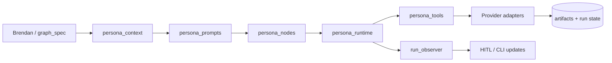

# MyloWare Architecture

**Version:** 1.0  
**Last Updated:** November 2025

---

## Overview

MyloWare is a production-grade multi-agent AI orchestration platform for automated video content creation. The system coordinates specialized AI agents (personas) through LangGraph state machines to handle the complete video production workflow: ideation → generation → editing → publishing.

**Core Capabilities:**
- Multi-agent coordination via LangGraph state machines
- Specialized personas with tool-scoped capabilities
- Human-in-the-loop (HITL) approval gates
- Webhook-based async provider integrations
- Full observability (LangSmith, Prometheus, Grafana, Sentry)
- Production deployment on Fly.io

---

## System Architecture

### Architecture Style
- **Orchestration:** Brendan (supervisor) coordinates project-specific persona graphs
- **State Management:** LangGraph with PostgreSQL checkpointing
- **API Gateway:** FastAPI with API key authentication
- **Integration:** Webhook-based async providers (kie.ai, Shotstack, upload-post)
- **Deployment:** Containerized services on Fly.io (Docker Compose for local dev)

### Key Components
- **API Service (FastAPI, :8080)** — HTTP gateway, webhooks, Telegram integration
- **Orchestrator (LangGraph, :8090)** — Persona graphs, checkpointing, state transitions
- **Database (PostgreSQL + pgvector)** — Runs, artifacts, knowledge base, checkpoints
- **Cache (Redis)** — Rate limiting, response caching
- **Observability** — LangSmith tracing, Prometheus metrics, Grafana dashboards, Sentry errors
- **MCP Adapter (Optional)** — JSON-RPC façade for Model Context Protocol

---

## Configuration Constants
- Classification thresholds: run ≥ 0.70; clarify 0.40–0.69; decline < 0.40
- Reviewer insertion: auto-reviewer when confidence < 0.65; rework when < 0.50
- kie.ai: model `veo-3-fast`; concurrency 4; queue 16; timeout 90s; webhook-only completion
- Shotstack features: templates, overlays, text, LUTs, motion, simple transitions (prefer templates)
- FFmpeg normalization: audio −14 LUFS, TP ≤ −1.0 dBTP, 48 kHz stereo; video 1920×1080@30fps, H.264 yuv420p, CRF 20, `+faststart`
- Hosting: Fly.io (US) MVP; shift to AWS ECS if enterprise IAM/VPC or scaling needs
- Domains: studio.mjames.dev (API), graph.mjames.dev (orchestrator)
- Vector DB: pgvector-first; migrate to managed (Weaviate/Qdrant) if >10M vectors, p95 >150ms, or ingestion >10k/min
- SLOs: tool p95 ≤ 2s; publish p95 ≤ 30s; run success ≥ 95%; webhook success ≥ 99%
- Telemetry sampling: traces 100% errors/10% success; logs 100% warn+error/10% info; metrics 100%
- Retention: artifacts/checkpoints 90d; webhooks 14d; logs 30d; backups nightly (RPO 24h, RTO 2h)

---

## Tech Stack

### Core Stack

| Technology | Version | Purpose |
| --- | --- | --- |
| Python | 3.11 | Primary runtime |
| FastAPI | latest | API gateway, webhooks |
| LangGraph | latest | Multi-agent orchestration |
| LangChain | latest | Persona agents, tools, retrieval |
| PostgreSQL + pgvector | 15+ | Primary database, vector search |
| Redis | 7 | Cache, rate limiting |
| LangSmith | latest | LLM tracing and evaluation |
| Prometheus/Grafana | latest | Metrics and dashboards |
| Sentry | latest | Error tracking |
| Docker | latest | Containerization |
| Fly.io | - | Production hosting |

---

## Data Models and Schema Changes

### Core Data Models
- socials
  - Purpose: Store social account config per project
  - Integration: FK via `project_socials`; support many-to-many
  - Key Attributes: provider, accountId, credentialRef/secretKey, defaultCaption, defaultTags, privacy, rateLimitWindow

- project_socials
  - Purpose: Map projects to one or more socials with an isPrimary flag
  - Key Attributes: projectId, socialId, isPrimary

- artifacts
  - Purpose: Persist outputs (ideas, scripts, clips, compilation, publish URL)
  - Integration: Linked to runs; vectorized summaries optional
  - Key Attributes: runId, type, url/path, checksum, metadata JSONB, createdAt

- webhook_events
  - Purpose: Persist inbound webhook deliveries for replay/debug
  - Integration: Linked to jobs/artifacts
  - Key Attributes: idempotencyKey, provider, headers, rawPayload, signatureStatus, receivedAt

- run payload / result (canonical JSON blobs)
  - Purpose: Provide a consistent shape for orchestrator/API consumers regardless of project
  - `runs.payload` keys:
    - `project`: project slug (e.g., `test_video_gen`)
    - `input`: normalized user input dict (prompt/topic/object/etc.)
    - `graph_spec`: `{ "pipeline": [persona order], "hitl_gates": [gate ids] }`
    - `user_id`: optional actor identifier (e.g., `telegram_123`)
    - `options`: feature flags / knobs for the run
    - `metadata`: freeform extras (e.g., `project_spec`, campaign tags)
  - `runs.result` keys:
    - `status`: api/orchestrator status string (pending/generating/published/...)
    - `publish_urls`: list of canonical URLs returned by Quinn/publisher
    - `artifacts`: high-level artifact summaries (optional)
    - `extra`: provider/job metadata (job_code, etc.)
  - Helper module: `core/runs/schema.py` (`build_graph_spec`, `build_run_payload`, `build_run_result`)

### Schema Integration Strategy (pseudo-DDL)
- New Tables (simplified):
  - `socials(id serial pk, provider text, account_id text, credential_ref text, default_caption text, default_tags text[], privacy text, rate_limit_window interval, created_at timestamptz)`
  - `project_socials(project_id uuid, social_id int, is_primary boolean default false, primary key(project_id, social_id))`
  - `artifacts(id uuid pk, run_id uuid, type text, url text, checksum text, metadata jsonb, created_at timestamptz)`
  - `webhook_events(id uuid pk, idempotency_key text unique, provider text, headers jsonb, raw_payload bytea, signature_status text, received_at timestamptz)`
- Indexes:
  - `create index on artifacts(run_id, type)`
  - `create index on webhook_events(idempotency_key)`
- Migration Strategy:
  - Alembic migrations; backups before apply; roll-forward; additive only

---

## Component Architecture

### Entry Points & Channel Flow
1. **External channels → API.** Telegram webhooks (`apps/api/integrations/telegram.py`) and the MCP adapter both forward user messages into `POST /v1/chat/brendan`. Direct humans/scripts should call the same endpoint; `/v1/runs/start` exists only for internal tooling and must not be called by users.
2. **Brendan chat → Orchestrator.** The API relays chat messages through `apps/api/routes/chat.py`, which authenticates with the orchestrator’s `/v1/chat/brendan` endpoint. Brendan’s graph decides whether a request needs clarification, a workflow proposal, or an actionable run.
3. **Workflow HITL → Production graph.** When Brendan proposes a run, the API stores the `graph_spec` and issues a workflow HITL link. Only after `/v1/hitl/approve/{runId}/workflow` is approved do we call the orchestrator’s `/runs/{runId}` endpoint.
4. **Workflow approval → LangGraph execution.** `/v1/hitl/approve/{runId}/workflow` causes the API to persist the run payload (input, `graph_spec`, `providers_mode`) and enqueue the run with the orchestrator. The FastAPI service never calls provider APIs directly—it just sets up state so personas can run.
5. **Persona graph execution + provider tools.** Each LangGraph node receives a context package from `apps/orchestrator/persona_context.py`, executes its LangChain agent via `apps/orchestrator/persona_nodes.py`, and invokes persona tools from `apps/orchestrator/persona_tools.py`. Those tools call adapter factories that select deterministic fakes (`providers_mode="mock"`) or real HTTP clients (`providers_mode="live"`). Tool invocations emit artifacts immediately, while provider webhooks (kie.ai, upload-post) write the source-of-truth status back into Postgres.
6. **Notifications back to Brendan.** `_send_notification` calls `/v1/notifications/graph/{runId}` so Brendan’s chat graph can surface interrupts, approvals, and completions in the conversation, keeping humans in the loop regardless of which channel they started from.

### New Components
- Orchestrator (LangGraph Server)
  - Responsibility: Execute state graphs with checkpoints; manage retries and streaming.
  - Integration Points: FastAPI triggers; DB checkpointer; LangSmith traces via callbacks.
  - Interfaces: Run create/continue APIs; checkpoint store; optional artifact sync (POST `/v1/runs/{id}/artifacts` when `artifact_sync_enabled=true`).
  - Modules: `apps/orchestrator/server.py`, `brendan_agent.py`, `graph_factory.py`, `persona_nodes.py`, `hitl_gate.py`.

- API (FastAPI)
  - Responsibility: External API, webhooks, HITL pages, artifact ingestion.
  - Integration Points: Telegram adapter; orchestrator service; DB; observability.
  - Interfaces: `/v1/chat/brendan`, `/v1/runs/*`, `/v1/webhooks/*`, `/v1/hitl/*`, `/v1/projects`, `/v1/runs/{id}/artifacts`; API key auth.
  - Modules: `apps/api/main.py`, `apps/api/routes/{runs,webhooks,hitl,notifications,projects,artifacts}.py`, `apps/api/services/test_video_gen/{orchestrator,state_updates,validator}.py`.

- Persona nodes & LangChain agents
  - Responsibility: Per-persona LangChain agents (Iggy, Riley, Alex, Quinn, optional specialists) that call project-scoped tools and emit structured artifacts.
  - Context Package: `apps/orchestrator/persona_context.py` now returns a minimal brief (`system_prompt`, run metadata, current videos/clips) so new contributors can reason about each persona in minutes.
  - Tooling: `apps/orchestrator/persona_tools.py` exposes least-privilege tools (submit generation jobs, wait for webhooks, render timelines, publish) that route through adapter factories (`providers_mode` determines fakes vs real clients).
  - Observability: Each persona node starts a LangSmith child run (`start_langsmith_child_run`) so operators/CLI (`mw-py runs watch`) can tail progress in real time; retrieval traces and provider artifacts are recorded against the `runId`.
  - Integration Points: Retrieval, kie.ai, Shotstack, upload-post, FFmpeg; persona prompts/tool allowlists under `data/personas/`.
  - Implementation: `apps/orchestrator/persona_context.py` assembles the persona brief, `apps/orchestrator/persona_prompts.py` composes system/user prompts, `apps/orchestrator/persona_nodes.py` wires the LangChain agents, `apps/orchestrator/run_observer.py` summarizes artifacts/status, `apps/orchestrator/persona_runtime.py` keeps persona state helpers isolated, and `apps/orchestrator/persona_tools.py` exposes tool functions that wrap provider adapters.
  - Persona Contracts: `_PERSONA_CONTRACTS` in `apps/orchestrator/persona_contracts.py` (re-exported by `persona_nodes`) is the single source of required tools per persona. `_validate_persona_contract` inspects LangChain tool calls and raises if a persona skipped a required tool that is available in the current project’s allowlist. Contract hints surface the “why” (e.g., Riley must call `submit_generation_jobs_tool` so kie.ai renders actually launch) and include `project` + `runId` metadata for debugging.
    - `iggy` must call `memory_search` to reload creative direction guardrails.
    - `riley` must call `memory_search` and `submit_generation_jobs_tool` to restate Veo3 guidance and submit kie.ai jobs.
    - `alex` must call `render_video_timeline_tool` to build the standard Shotstack template once per run.
    - `quinn` must call `memory_search` and `publish_to_tiktok_tool` to confirm platform requirements and publish for a canonical URL.
  - Contract Flexibility: Project JSON expectations (`data/projects/*/agent-expectations.json`) still gate which tools are exposed. If a project removes a tool from `allowed_tools`, `_validate_persona_contract` automatically skips that requirement, so projects stay least-privilege without editing the contract table. To add a new required tool, update `_PERSONA_CONTRACTS` and extend `tests/unit/python_orchestrator/test_persona_contract_enforcement.py`.
  - Allowlist Mode: `apps/orchestrator/config.Settings.persona_allowlist_mode` controls how personas behave when an allowlist is misconfigured. In the default `fail_fast` mode, missing/invalid allowlists raise loudly during tool registration; `memory_fallback` mode is available as an escape hatch that injects `memory_search` instead (with warnings) when configuration is incomplete.
  - Evidence:
    - `apps/orchestrator/citations.py` appends the doc IDs/paths returned by `memory_search` so LangSmith + HITL reviewers can see which KB entries informed a step.
    - Provider adapters emit structured artifacts (e.g., `kieai.job`, `shotstack.timeline`, `publish.url`) so downstream audits do not require replaying logs.

- Knowledge Base (KB)
  - Responsibility: Ingest markdown/JSON references into `kb_documents`/`kb_embeddings` and serve searches scoped by project/persona.
  - Implementation: `core/knowledge/retrieval.py` handles ingestion (markdown, JSON, chunking via LangChain splitters) and search. Embeddings are routed through the OpenAI adapter (`adapters/ai_providers/embeddings/openai_client.py`) with deterministic hash fallbacks for offline/dev modes.
  - Interfaces: `mw-py ingest run` CLI command, `mw-py kb ingest --dir data/kb/ingested`, and direct `search_kb` helpers inside personas/tools.
  - Observability: `kb_search_seconds` histogram in Prometheus + artifact evidence (`retrieval.trace`). Logs show project/persona labels so we can spot runaway queries.

- CLI (`mw-py`)
  - Responsibility: Operator entry point for validations, KB ingestion, orchestrator/API tooling, staging deploys, etc.
  - Modules: `cli/main.py`, `cli/commands/*` mirror API services (runs, kb, deploy, staging logs). CLI commands rely on the same settings object as the API so secrets/env behaviour stays consistent.
  - Key flows: `mw-py validate env`, `mw-py validate personas`, `mw-py validate config`, `mw-py ingest run`, `mw-py demo test-video-gen --env staging`, `mw-py staging deploy orchestrator`. Each command surfaces HITL approvals, run IDs, coverage deltas, and uses API key auth under the hood.

#### Provider Tool Boundary (REAL endpoint calls)

1. **Generation (`submit_generation_jobs_tool`) — REAL endpoint call.** Uses `get_kieai_client(settings)` to hit the kie.ai job API. In `providers_mode="mock"` the factory returns `KieAIFakeClient`; in `"live"` it returns the HTTP client and records a `kieai.job` artifact. Kie.ai webhooks (HMAC + idempotency enforced in FastAPI) update `runs.result.videos`.
2. **Render (`render_video_timeline_tool`) — REAL endpoint call.** Builds the Shotstack timeline via `content.editing.timeline`, calls `get_shotstack_client(settings).render(...)`, and records `shotstack.timeline` + `render.url` artifacts. FFmpeg normalization artifacts document post-processing.
3. **Publish (`publish_to_tiktok_tool`) — REAL endpoint call.** Invokes `get_upload_post_client(settings)` to post the final video. Metadata + canonical URLs are stored as `publish.url` artifacts; optional upload-post webhooks replay into the DB with idempotency.
4. **Wait/poll (`wait_for_generations_tool`).** Polls Postgres for kie.ai completion without external network calls to preserve determinism in mock mode.

Only the adapter factories perform environment branching, keeping the LangGraph business logic identical between mock and live runs.

- Tool Adapters (libs)
  - Responsibility: Thin wrappers around SDKs/APIs with idempotency + retries.
  - Integration Points: Agents; API webhooks; DB.

### Run lifecycle (Brendan-first)
1. **Conversation:** `/v1/chat/brendan` (API) forwards to `apps/orchestrator/brendan_agent.py` which classifies the request, derives the pipeline/optional personas, and immediately starts the LangGraph run via `/v1/runs/start`.
2. **Production graph:** `apps/orchestrator/graph_factory.py` builds a state graph with one node per persona plus the configured HITL gates; `persona_nodes.py` executes LangChain agents.
3. **Interrupts & approvals:** HITL nodes emit artifacts + notifications. `/v1/hitl/approve/{runId}/{gate}` (ideate/prepublish) resumes the LangGraph graph via orchestrator resume commands.
4. **Artifacts & completion:** Persona nodes write structured artifacts via `/v1/runs/{runId}/artifacts`; Quinn publishes via upload-post; the run result is stored through `core/runs/schema.py`.
5. **Evidence & observability:** Retrieval traces, provider artifacts, LangSmith traces, and Prometheus metrics capture the state so `scripts/dev/check_slos.py` can gate releases.

### MCP Adapter (FastAPI)

- **Purpose:** Thin JSON-RPC surface that exposes Brendan’s capabilities over MCP-friendly tooling (`ask_brendan`, `start_run`, `get_run_status`, `list_projects`).
- **Implementation:** `apps/mcp_adapter` (FastAPI + httpx) forwards requests to the FastAPI API and LangGraph orchestrator using API key auth; exposes `/health`, `/metrics`, and `/mcp`.
- **Deployment:** Optional Docker Compose profile `mcp`; scales independently from API/Orchestrator.
- **Future work:** Add SSE/WebSocket streaming passthrough for Brendan responses.

### Pipelines (Current)

- **Test Video Gen:** Pipeline defined in `data/projects/test_video_gen/project.json`; Iggy (storyboards) → Alex (timeline/Shotstack) → Quinn (publish). Managed by `VideoGenService` + `graph_factory.build_project_graph`.
- **AISMR:** Pipeline from `data/projects/aismr/project.json`; Brendan (workflow) → Iggy (ideas) → HITL (`ideate`) → Riley (scripts/kie.ai clips) → Alex (Shotstack/FFmpeg) → [Morgan optional sound design] → Quinn (upload-post) → HITL (`prepublish`). All persona nodes live in `apps/orchestrator/persona_nodes.py`.

| Project | Graph Spec | Persona order | Required HITL gates | Story Doc | Notes |
| --- | --- | --- | --- | --- | --- |
| `test_video_gen` | `data/projects/test_video_gen/project.json` | Brendan (workflow) → Iggy → Alex → Quinn | `workflow`, `prepublish` (Quinn) | [Story 1.2](stories/1.2.test-video-gen-pipeline.md) | Default mock/demo pipeline (mocks when `USE_MOCK_PROVIDERS=true`). |
| `aismr` | `data/projects/aismr/project.json` | Brendan → Iggy → Riley → Alex → Quinn (+optional Morgan) | `workflow`, `ideate`, `prepublish` | [Story 1.3](stories/1.3.aismr-pipeline.md) | Generates 12 surreal clips; Riley drives kie.ai, Alex handles Shotstack/FFmpeg. |

Each spec defines persona order, gate placement, and persona-specific metadata. Brendan serializes the chosen `graph_spec` into the run payload so that workflow approvals and resumptions replay the exact configuration.

### Persona Execution Stack

1. **Context & Expectations** — `apps/orchestrator/persona_context.py` pulls run metadata, project specs (`data/projects/*/agent-expectations.json`), and persona KB references to build the least-privilege brief exposed to each LangChain agent.
2. **Prompt Composition** — `apps/orchestrator/persona_prompts.py` loads persona prompt assets from `data/personas/**` and assembles the system/user messages the LangChain agents consume.
3. **Agent Nodes** — `apps/orchestrator/persona_nodes.py` instantiates each persona agent, attaches `_PERSONA_CONTRACTS`, and injects the context/prompt/runtime helpers before wiring the node into the LangGraph state machine defined in `graph_factory.py`.
4. **Runtime Helpers** — `apps/orchestrator/persona_runtime.py` centralizes observation summaries, artifact counters, and deterministic mock-provider fallbacks so persona nodes stay thin.
5. **Observation Loop** — `apps/orchestrator/run_observer.py` watches run artifacts, derives persona-specific progress updates, and feeds `state_updates` back to HITL reviewers + Telegram/CLI surfaces.
6. **Tool Boundary** — `apps/orchestrator/persona_tools.py` exposes functions that call adapter factories inside `adapters/ai_providers/*`, emit structured artifacts, and record provenance in Postgres.



### Component Interaction Diagram (Mermaid)
```mermaid
graph TD
  TG[Telegram] --> API
  API --> LG[LangGraph Server]
  LG -->|workflow spec| B[Brendan Agent]
  B --> Iggy
  Iggy --> HITL1[HITL: ideate]
  HITL1 --> Riley
  Riley --> Alex
  Riley -->|kie.ai| KIE[kie.ai]
  Alex --> Optional[morgan?]
  Alex -->|Shotstack/FFmpeg| SS[Shotstack]
  Optional --> Quinn
  Optional -->|audio cues| SD[Sound Design]
  Quinn --> HITL2[HITL: prepublish]
  Quinn -->|upload| UP[upload-post]
  KIE -->|Webhook (HMAC)| API
  SS -->|Jobs/API| API
  SD -->|Artifacts| API
  UP -->|Publish/API| API
  API --> DB[(Postgres + pgvector)]
  API --> Obs[OTel + LangSmith]
```

---

## Security & Webhook Signing
- API key for internal endpoints; rate limiting per key
- Webhooks: HMAC-SHA256 in `X-Signature` over raw body; include `X-Request-Id`, `X-Timestamp`
- Replay protection: cache request IDs for 24h; allow ±5m skew
- Telegram webhook dedup: 60 s in-memory cache of `update_id` + `chat_id/message_id` prevents duplicate run starts when Telegram retries
- Secrets: stored in Fly secrets (sourced from 1Password); quarterly rotation target (post-MVP)

### Threat Model & Mitigations (summary)
- Prompt injection → Strict tool allowlists per persona; sanitize inputs; reviewer gates
- SSRF/data exfiltration → Allowlist domains; timeouts; content-type validation; size caps
- Webhook replay/tampering → HMAC, idempotency cache, timestamp window; alert anomalies
- Credential leakage → Secrets in platform store only; redacted logs; least-privilege tokens
- Provider abuse/outage → Retries/backoff, DLQ, fallback messaging; clear error taxonomy

---

## Observability & Telemetry
- LangSmith for LLM traces and eval datasets per project; traces show **one continuous agent execution** with persona switches marked as tool calls
- Prometheus instrumentation on API routes, LangGraph persona nodes, DB calls, and webhooks
- Prometheus metrics: `agent_iteration_seconds`, `persona_switch_count`, `tool_call_duration_seconds` (labeled by persona and tool)
- Sampling: traces 100% errors/10% success; logs 100% warn+error/10% info; metrics 100%
- Dashboards: Grafana panels for agent iteration p95, persona switch counts, tool p95s, publish p95, error rates, queue depth
- Alerts: p95 publish > 45s over 10m; tool error rate > 5% over 15m; webhook failures > 1% over 30m

---

## Error Taxonomy
- 400 Bad Request — validation failures, schema errors
- 401 Unauthorized — missing/invalid API key
- 403 Forbidden — tool/persona not allowed
- 404 Not Found — run/artifact not found
- 409 Conflict — duplicate/idempotency violation
- 429 Too Many Requests — rate limit exceeded
- 502/503 External Service Error — provider outage/timeouts
- 500 Internal Error — unhandled exceptions (with requestId)

---

## Rate Limits, Concurrency, Backpressure
- API: 60 req/min per API key (burst 10)
- KIE jobs: concurrency 4 per run; queue 16; backoff 1s→32s (max 5 attempts)
- Webhooks: dedupe by `X-Request-Id` for 24h; reject > 1MB payloads
- DB: max connections sized to container; use pooled connections in FastAPI

---

## Scaling Plan
- Horizontal scale: 2–3 replicas each for API and orchestrator (Fly)
- Stateless services; sticky sessions not required
- Postgres: scale vertically first; move to read replicas if needed
- Vector DB migration criteria: >10M vectors, p95 >150ms steady, >10k/min ingestion

---

## Cutover Strategy (Dual-Run)
- Phases B–D run exclusively on new stack in staging
- Optional: dual-run first public runs (shadow traffic) for 1–2 days
- Switch DNS for API to new stack after Gate F; keep a 1-week rollback window

---

## Test Environments & Data
- Local: Docker Compose with seeded small fixtures and webhook replayers
- Staging: Fly org app with restricted tokens; synthetic webhook events for reliability tests
- Datasets: LangSmith datasets for ideation/script quality and tool selection

---

## Performance Testing Plan
- Load: 20 concurrent runs (Test Video Gen) for 10 minutes; ensure p95 publish ≤ 30s
- Spike: burst to 50 runs; system recovers within 2 minutes; DLQ < 1%
- Profiling: identify slow steps; adjust concurrency and timeouts accordingly

---

## API Design and Integration
- **API Strategy:** REST endpoints for run lifecycle and webhooks; versioned under /v1; API key auth; signed webhooks
- **Endpoints (MVP):**
  - POST `/v1/runs/start` — Start pipeline
    - Request: `{ "project": "test_video_gen"|"aismr", "input"?: { ... } }`
    - Response: `{ "runId": "uuid", "status": "started" }`
  - POST `/v1/runs/{runId}/continue` — Resume/continue
  - POST `/v1/webhooks/kieai` — KIE job events (HMAC, idempotent)
  - POST `/v1/webhooks/upload-post` — Publish confirmation (HMAC)
  - GET `/v1/hitl/approve/{runId}/{gate}` — Approve ideate|prepublish (signed link)

---

## External API Integration
- kie.ai API
  - Async jobs via webhook; retries with backoff (max 5); concurrency 4; queue 16
- Shotstack SDK/API
  - Timeline JSON + templates/LUTs/motion; render mp4; FFmpeg normalization afterwards
  - Adapter (`adapters/ai_providers/shotstack/client.py`) enforces host allowlists via `ensure_host_allowed`, derives deterministic idempotency keys, wraps calls in `CircuitBreaker` + `run_with_retry`, and optionally caches renders with `ResponseCache` to keep retries safe.
- upload-post API
  - TikTok publish; capture URL; extend to YouTube then IG later

---

## Config & Secrets
- Required env vars (API): `API_KEY`, `DB_URL`, `REDIS_URL`, `SENTRY_DSN`, `LANGSMITH_API_KEY`
- Domains: `public_base_url`, `webhook_base_url` (derived from Fly app name; no manual overrides needed in staging/prod)

### Provider Secrets Checklist

For live providers, ensure these are set (typically via Fly secrets/1Password)
before enabling `USE_MOCK_PROVIDERS=false`:

- kie.ai:
  - `KIEAI_API_KEY`
  - `KIEAI_BASE_URL`
  - `KIEAI_SIGNING_SECRET`
- Shotstack:
  - `SHOTSTACK_API_KEY`
  - `SHOTSTACK_BASE_URL`
- upload-post:
  - `UPLOAD_POST_API_KEY`
  - `UPLOAD_POST_BASE_URL`
  - `UPLOAD_POST_SIGNING_SECRET`

Also configure:
- `HITL_SECRET` – for signing HITL approval links.
- `TELEGRAM_BOT_TOKEN` – only if Telegram integration is enabled.

### Security Overview

- **API authentication:** Every mutating endpoint requires our API key middleware (`APIKeyMiddleware`) or explicit `Depends(verify_api_key)` protection. Only `/health`, `/metrics`, docs, and public webhooks/Telegram routes are exempt so observability probes keep working without secrets.
- **Webhooks:** Provider callbacks (kie.ai, upload-post) include HMAC signatures that we verify before enqueueing work. Artifacts store raw payloads + signature status for 14 days.
- **Host allowlists & SSRF:** Adapters must call `ensure_host_allowed` on their base URLs (`ShotstackClient`, `KieAIClient`, `UploadPostClient`, FFmpeg normalizer). Local/test hosts are only allowed when `allow_dev_hosts=True`. In strict startup modes the orchestrator also runs `validate_adapter_hosts(settings)` so misconfigured base URLs fail fast instead of surfacing only on first provider call.
- **Rate limiting & logging:** `rate_limit_dependency` guards hot routes (e.g., `/v1/runs/start`, `/v1/runs/{runId}/continue`, `/v1/hitl/approve/{runId}/{gate}`, `/v1/chat/brendan`) and `RequestIDMiddleware` adds traceable IDs to every log entry. API logs capture run IDs, actors, and status while redacting secrets. A Prometheus counter (`api_rate_limited_requests_total`) records 429s by logical limiter name.

---

## Logging Schema & PII Redaction
- Fields: `timestamp`, `level`, `requestId`, `runId`, `actor`, `event`, `status`, `latencyMs`, `errorCode?`
- Redact: tokens, URLs with creds, raw payloads (store in `webhook_events` table)
- Sampling in prod: info 10%, warn/error 100%

---

## Monitoring & Alerts (detailed)
- Prometheus metrics: `http_request_duration_seconds`, `tool_call_duration_seconds`, `webhook_events_total`, `runs_active`, `runs_success_total`, `runs_failure_total`
- Alerts:
  - `runs_failure_total` increase over baseline > 5% in 15m
  - `webhook_events_total{status="failed"}` > 1% in 30m
  - `tool_call_duration_seconds{quantile="0.95"}` > 2s for 10m

---

## Phases & Gates (Implementation Alignment)
- Phase A: Platform bootstrap → Gate A: health/metrics/traces OK
- Phase B: Test Video Gen E2E → Gate B: publish p95 ≤ 30s, idempotent webhooks
- Phase C: AISMR with ideate HITL → Gate C: p95 tools ≤ 2s, run success ≥ 95%
- Phase D: Reserved for future pipeline → Gate D: currently unused in active program
- Phase E: Telegram adapter → Gate E: manual tests, logs redacted, Sentry exceptions captured
- Phase F: Hosting & Ops → Gate F: backup drill, domains live, rollback tested
- Phase G: Final hardening → Gate G: CI green, no deprecated endpoints invoked

---

## Sign-off Checklists
- Product Owner: features present per PRD; HITL UX acceptable; UAT scripts pass
- Architect: SLOs met; security controls in place; threat mitigations documented
- PM: gates and dates met; risks tracked and mitigations enacted
- Scrum Master: DOR/DOD followed; ceremonies held; impediments resolved
- Dev Lead: code quality; coverage ≥ 50%; runbooks complete
- QA Lead: test plan executed; contract tests for webhooks; E2E/Load pass

---

## Next Steps
- Execute Phase A per PRD; schedule Gate A review with all signatories
- Proceed phase-by-phase; require sign-off at each gate before advancing
### Schema & Migrations

- Alembic (Python) is the single source of truth for database schema.
- Services access Postgres via psycopg; adapters encapsulate DB access patterns.
