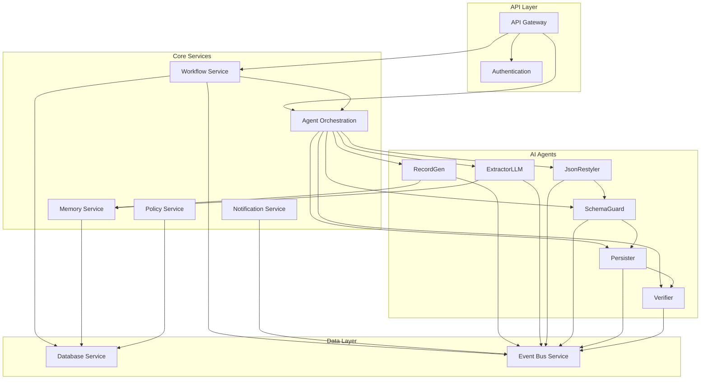

# Components

## Core Service Components

**API Gateway Service**

- **Responsibility:** Central entry point for all external requests, authentication, rate limiting, and request routing
- **Key Interfaces:**
  - REST API endpoints for work order management
  - WebSocket connections for real-time updates
  - Authentication and authorization middleware
  - Request/response transformation and validation
- **Dependencies:** Authentication Service, Workflow Service, Notification Service
- **Technology Stack:** NestJS, JWT authentication, rate limiting middleware, OpenAPI documentation

**Workflow Orchestration Service**

- **Responsibility:** Manages Temporal workflows, coordinates document processing, and maintains workflow state
- **Key Interfaces:**
  - Workflow creation and management APIs
  - Workflow status and progress tracking
  - Error handling and retry logic
  - Workflow template management
- **Dependencies:** Temporal, Agent Orchestration Service, Database Service
- **Technology Stack:** Temporal SDK, NestJS, Prisma ORM, Winston logging

**Agent Orchestration Service**

- **Responsibility:** Manages AI agents, coordinates agent interactions, and handles agent lifecycle
- **Key Interfaces:**
  - Agent creation and configuration APIs
  - Agent execution and monitoring
  - Tool integration and management
  - Agent memory and context management
- **Dependencies:** OpenAI Agents SDK, Memory Service, Tool Service, External AI APIs
- **Technology Stack:** OpenAI Agents SDK, NestJS, Axios for API calls, Circuit breaker pattern

**Memory Service**

- **Responsibility:** Manages agent memory, context storage, and knowledge retrieval
- **Key Interfaces:**
  - Memory document CRUD operations
  - Vector similarity search
  - Context retrieval and management
  - Memory optimization and cleanup
- **Dependencies:** PostgreSQL with pgvector, Redis for caching
- **Technology Stack:** Prisma ORM, pgvector extension, Redis caching, Vector similarity algorithms

**Policy Service**

- **Responsibility:** Implements human-in-the-loop policies, approval workflows, and governance rules
- **Key Interfaces:**
  - Policy evaluation and decision APIs
  - Approval workflow management
  - Policy versioning and updates
  - Audit trail and compliance tracking
- **Dependencies:** Database Service, Notification Service, Slack Integration
- **Technology Stack:** NestJS, Joi validation, Policy engine, Audit logging

**Notification Service**

- **Responsibility:** Handles all notifications, alerts, and communication with external systems
- **Key Interfaces:**
  - Slack integration and message sending
  - Email notifications and alerts
  - Webhook management and delivery
  - Notification templating and personalization
- **Dependencies:** Slack API, Email service, Webhook management
- **Technology Stack:** @slack/bolt SDK, Nodemailer, Webhook management, Template engine

**Database Service**

- **Responsibility:** Centralized data access layer with repository pattern implementation
- **Key Interfaces:**
  - Repository interfaces for all entities
  - Transaction management
  - Data validation and sanitization
  - Database migration and schema management
- **Dependencies:** PostgreSQL, Redis
- **Technology Stack:** Prisma ORM, Database migrations, Connection pooling, Data validation

**Event Bus Service**

- **Responsibility:** Manages Redis Streams for event-driven communication between services
- **Key Interfaces:**
  - Event publishing and subscription
  - Consumer group management
  - Dead letter queue handling
  - Event schema validation
- **Dependencies:** Redis Streams
- **Technology Stack:** Redis client, Stream processing, Consumer groups, Outbox pattern

## AI Agent Components

**RecordGen Agent**

- **Responsibility:** Generates initial records and context for document processing
- **Key Interfaces:**
  - Document analysis and record generation
  - Context extraction and summarization
  - Initial data structure creation
- **Dependencies:** OpenAI/Anthropic APIs, Memory Service
- **Technology Stack:** OpenAI Agents SDK, Prompt engineering, Context management

**ExtractorLLM Agent**

- **Responsibility:** Extracts structured data from documents using LLM processing
- **Key Interfaces:**
  - Document content extraction
  - Structured data generation
  - Multi-format document support
- **Dependencies:** OpenAI/Anthropic APIs, Schema Service
- **Technology Stack:** OpenAI Agents SDK, Multi-provider strategy, Token budgeting

**JsonRestyler Agent**

- **Responsibility:** Transforms and standardizes extracted data into consistent JSON format
- **Key Interfaces:**
  - Data transformation and normalization
  - JSON schema compliance
  - Data quality validation
- **Dependencies:** Schema Service, Validation Service
- **Technology Stack:** JSON processing, Schema validation, Data transformation

**SchemaGuard Agent**

- **Responsibility:** Validates data against schemas and ensures compliance with business rules
- **Key Interfaces:**
  - Schema validation and enforcement
  - Business rule checking
  - Data quality assessment
- **Dependencies:** Schema Service, Policy Service
- **Technology Stack:** JSON Schema validation, Business rule engine, Quality metrics

**Persister Agent**

- **Responsibility:** Persists validated data to the database and manages data lifecycle
- **Key Interfaces:**
  - Data persistence operations
  - Transaction management
  - Data versioning and history
- **Dependencies:** Database Service, Transaction Service
- **Technology Stack:** Prisma ORM, Transaction management, Data versioning

**Verifier Agent**

- **Responsibility:** Performs final verification and quality assurance on processed data
- **Key Interfaces:**
  - Data verification and validation
  - Quality scoring and assessment
  - Error detection and reporting
- **Dependencies:** Quality Service, Notification Service
- **Technology Stack:** Quality assessment algorithms, Verification rules, Error reporting

## Component Diagrams

