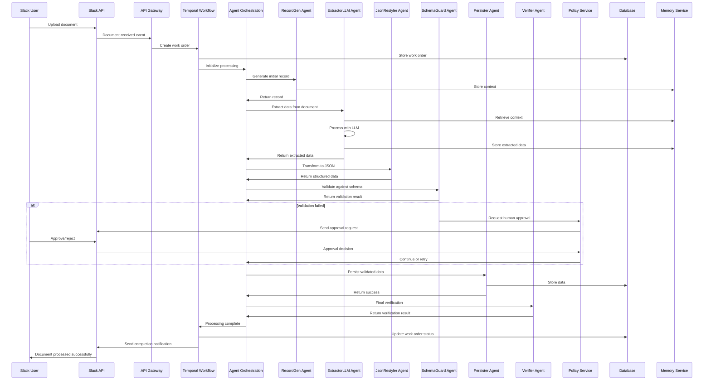
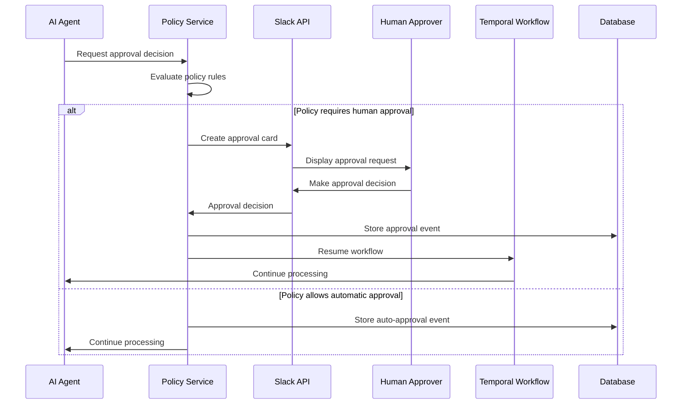
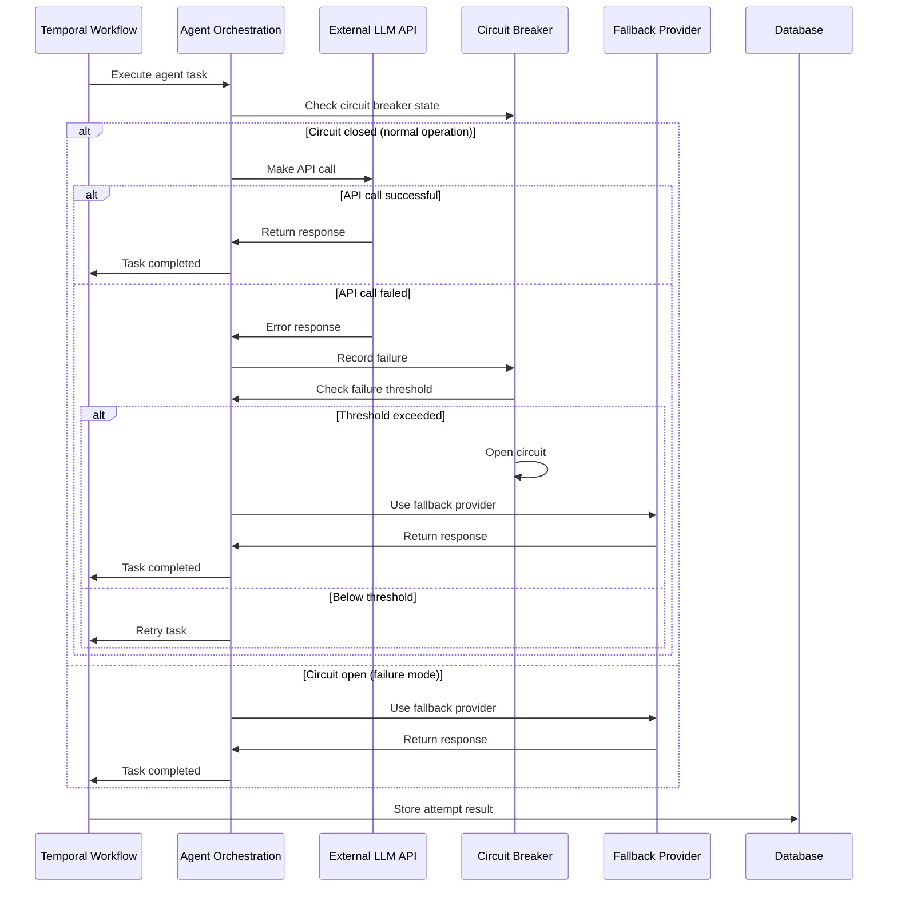

# Core Workflows

## Document Processing Workflow

```mermaid
sequenceDiagram
    participant User as Slack User
    participant Slack as Slack API
    participant API as API Gateway
    participant Workflow as Temporal Workflow
    participant Agent as Agent Orchestration
    participant Record as RecordGen Agent
    participant Extract as ExtractorLLM Agent
    participant Json as JsonRestyler Agent
    participant Schema as SchemaGuard Agent
    participant Persist as Persister Agent
    participant Verify as Verifier Agent
    participant Policy as Policy Service
    participant DB as Database
    participant Memory as Memory Service

    User->>Slack: Upload document
    Slack->>API: Document received event
    API->>Workflow: Create work order
    Workflow->>DB: Store work order
    Workflow->>Agent: Initialize processing

    Agent->>Record: Generate initial record
    Record->>Memory: Store context
    Record->>Agent: Return record

    Agent->>Extract: Extract data from document
    Extract->>Memory: Retrieve context
    Extract->>Extract: Process with LLM
    Extract->>Memory: Store extracted data
    Extract->>Agent: Return extracted data

    Agent->>Json: Transform to JSON
    Json->>Agent: Return structured data

    Agent->>Schema: Validate against schema
    Schema->>Agent: Return validation result

    alt Validation failed
        Schema->>Policy: Request human approval
        Policy->>Slack: Send approval request
        User->>Slack: Approve/reject
        Slack->>Policy: Approval decision
        Policy->>Agent: Continue or retry
    end

    Agent->>Persist: Persist validated data
    Persist->>DB: Store data
    Persist->>Agent: Return success

    Agent->>Verify: Final verification
    Verify->>Agent: Return verification result

    Agent->>Workflow: Processing complete
    Workflow->>DB: Update work order status
    Workflow->>Slack: Send completion notification
    Slack->>User: Document processed successfully
```

## Human-in-the-Loop Approval Workflow

```mermaid
sequenceDiagram
    participant Agent as AI Agent
    participant Policy as Policy Service
    participant Slack as Slack API
    participant User as Human Approver
    participant Workflow as Temporal Workflow
    participant DB as Database

    Agent->>Policy: Request approval decision
    Policy->>Policy: Evaluate policy rules

    alt Policy requires human approval
        Policy->>Slack: Create approval card
        Slack->>User: Display approval request
        User->>Slack: Make approval decision
        Slack->>Policy: Approval decision
        Policy->>DB: Store approval event
        Policy->>Workflow: Resume workflow
        Workflow->>Agent: Continue processing
    else Policy allows automatic approval
        Policy->>DB: Store auto-approval event
        Policy->>Agent: Continue processing
    end
```

## Error Handling and Retry Workflow

```mermaid
sequenceDiagram
    participant Workflow as Temporal Workflow
    participant Agent as Agent Orchestration
    participant LLM as External LLM API
    participant Circuit as Circuit Breaker
    participant Fallback as Fallback Provider
    participant DB as Database

    Workflow->>Agent: Execute agent task
    Agent->>Circuit: Check circuit breaker state

    alt Circuit closed (normal operation)
        Agent->>LLM: Make API call
        alt API call successful
            LLM->>Agent: Return response
            Agent->>Workflow: Task completed
        else API call failed
            LLM->>Agent: Error response
            Agent->>Circuit: Record failure
            Circuit->>Agent: Check failure threshold
            alt Threshold exceeded
                Circuit->>Circuit: Open circuit
                Agent->>Fallback: Use fallback provider
                Fallback->>Agent: Return response
                Agent->>Workflow: Task completed
            else Below threshold
                Agent->>Workflow: Retry task
            end
        end
    else Circuit open (failure mode)
        Agent->>Fallback: Use fallback provider
        Fallback->>Agent: Return response
        Agent->>Workflow: Task completed
    end

    Workflow->>DB: Store attempt result
```
