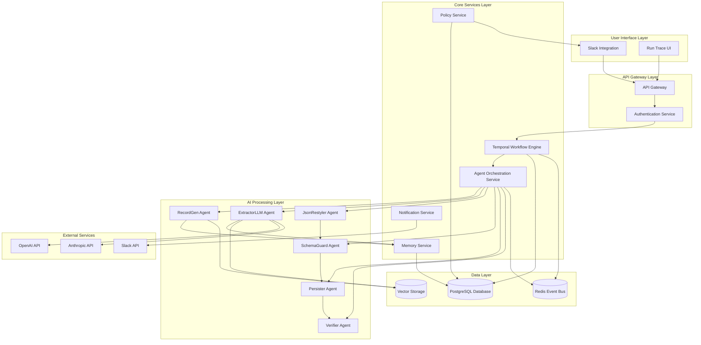

# High Level Architecture

## Technical Summary

MyloWare implements a **simplified microservices architecture** with **event-driven communication** and **Temporal workflow orchestration**. The system uses **PostgreSQL** for data persistence, **Redis Streams** for event bus communication, and **OpenAI Agents SDK** for AI orchestration. The architecture follows **Slack-first integration** with **human-in-the-loop governance** and emphasizes **cost optimization** and **operational excellence**. This design supports the PRD's goals of rapid MVP delivery, enterprise governance, and scalable AI-powered document processing.

## High Level Overview

**Architectural Style:** Simplified Microservices with Event-Driven Communication

**Repository Structure:** Monorepo (as specified in PRD) for unified development and deployment

**Service Architecture:**

- Core microservices with clear boundaries
- Temporal for workflow orchestration and state management
- Event-driven communication via Redis Streams
- HTTP REST APIs for service communication (MVP phase)

**Primary User Interaction Flow:**

1. Users interact primarily through Slack integration
2. Document processing workflows are orchestrated by Temporal
3. AI agents process documents using OpenAI Agents SDK
4. Human-in-the-loop approvals occur via Slack approval cards
5. Run Trace UI provides observability and debugging capabilities

**Key Architectural Decisions:**

- **Simplified Microservices**: Reduced complexity for MVP while maintaining scalability
- **Temporal Workflow Orchestration**: Ensures deterministic execution, retries, and idempotency
- **Event-Driven Communication**: Decouples services and enables async processing
- **Slack-First Integration**: Primary user interface for rapid adoption
- **Cost-Optimized AI**: Multi-provider strategy with strict token budgeting

## High Level Project Diagram

## Architectural and Design Patterns

**Event-Driven Architecture:** Using Redis Streams for asynchronous service communication - _Rationale:_ Enables loose coupling, supports high throughput, and provides reliable message delivery with consumer groups

**Workflow Orchestration Pattern:** Using Temporal for complex workflow management - _Rationale:_ Provides deterministic execution, built-in retries, idempotency, and comprehensive observability for document processing workflows

**Repository Pattern:** Abstract data access logic across all services - _Rationale:_ Enables testing, supports future database migrations, and provides consistent data access patterns

**Agent Pattern:** Using OpenAI Agents SDK for AI orchestration - _Rationale:_ Provides standardized agent interfaces, built-in memory management, and tool integration capabilities

**CQRS Pattern:** Separate read and write models for complex queries - _Rationale:_ Optimizes performance for different access patterns and supports complex reporting requirements

**Circuit Breaker Pattern:** For external API calls (OpenAI, Anthropic) - _Rationale:_ Prevents cascading failures and provides graceful degradation when external services are unavailable

**Outbox Pattern:** For reliable event publishing - _Rationale:_ Ensures events are published even if the event bus is temporarily unavailable
